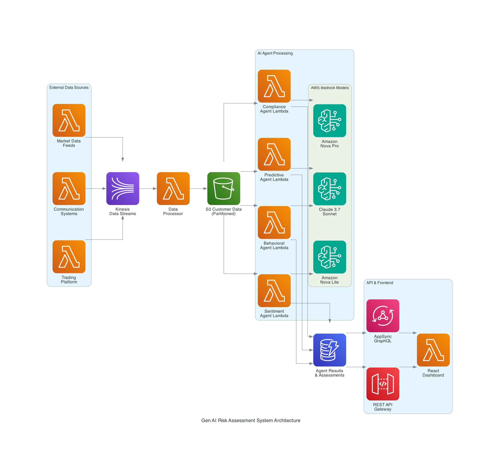
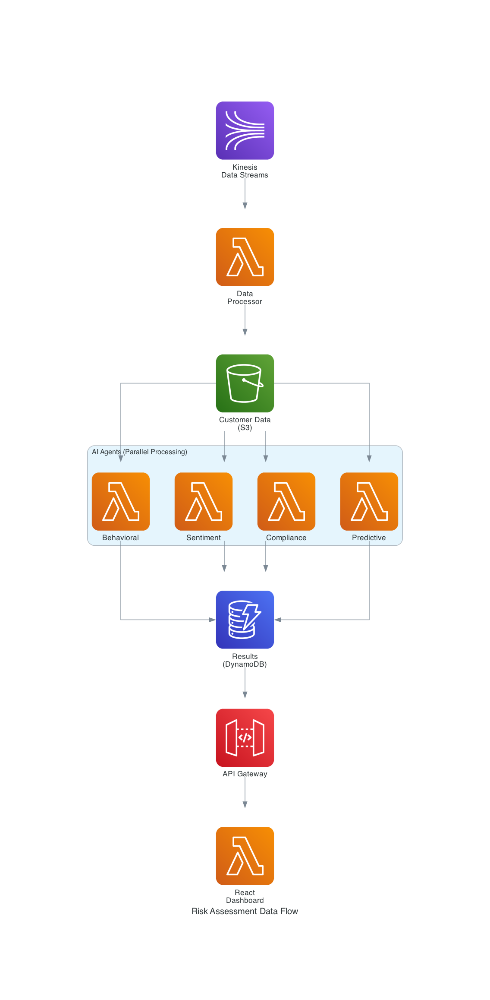

# Gen AI-Powered Customer Risk Assessment Engine Design

## Overview

The Gen AI-Powered Customer Risk Assessment Engine analyzes customer risk profiles using multiple specialized AI agents. The system processes customer data (transactions, communications, behavioral patterns) through five independent AI agents that provide comprehensive risk analysis with explainable insights.

**Core Capabilities:**
- **Multi-Agent Analysis**: Five specialized agents (Behavioral, Sentiment, Compliance, Predictive, Market Context) analyze different risk dimensions
- **Explainable AI**: Natural language explanations for all risk assessments to meet regulatory requirements
- **Real-time Processing**: Immediate risk updates as new customer data arrives
- **Cost-Effective**: Pay-per-use foundation models with intelligent model selection per task

**Business Value:**
- Comprehensive risk assessment combining quantitative metrics with behavioral insights
- Regulatory compliance through explainable AI decisions
- Proactive risk management with predictive analytics
- Scalable architecture supporting thousands of concurrent assessments

## Architecture

### System Architecture Diagram



### Data Flow Diagram



### System Flow

The system follows a simple, event-driven architecture:

```
Customer Data → Kinesis → Lambda → S3 → Agent Processing → DynamoDB → Frontend
```

**Data Flow:**
1. **Data Ingestion**: Customer data (transactions, communications, behavioral patterns) flows into Kinesis Data Streams
2. **Data Storage**: Lambda processes and stores data in S3, partitioned by customer
3. **Agent Triggering**: S3 events trigger five independent Lambda functions (one per agent type)
4. **AI Analysis**: Each agent analyzes customer data using appropriate Bedrock foundation models
5. **Result Storage**: Agent results stored in DynamoDB with real-time updates to frontend
6. **Final Assessment**: When all agents complete, system synthesizes final risk assessment

### Core Components

**Data Layer:**
- **Amazon Kinesis**: Real-time data ingestion from external systems
- **Amazon S3**: Customer data storage with automatic lifecycle management
- **Amazon DynamoDB**: Agent results and final assessments storage

**Processing Layer:**
- **AWS Lambda**: Serverless functions for data processing and agent execution
- **AWS Bedrock**: Foundation models for AI analysis (Claude 3.5 Sonnet/Haiku, Amazon Nova Lite/Micro, Amazon Titan Text Express)
- **Strands Framework**: Agent orchestration and memory management

**Interface Layer:**
- **AWS API Gateway**: RESTful API for customer assessment retrieval
- **AWS AppSync**: Real-time GraphQL subscriptions for live updates
- **React Frontend**: Interactive dashboard with scenario simulation and agent transparency
- **Conversational Interface**: Natural language queries to agents for detailed explanations

### Agent Architecture

Five specialized agents analyze different risk dimensions:

**Behavioral Agent** (Claude 3.5 Haiku)
- **Rationale**: Complex behavioral pattern analysis requires strong reasoning but Haiku provides 3x cost savings vs Sonnet for similar quality on structured analysis tasks
- Analyzes transaction patterns and investment behavior
- Determines risk tolerance and investment style
- Identifies concerning behavioral flags

**Sentiment Agent** (Amazon Nova Micro)
- **Rationale**: Sentiment analysis is well-suited for the most cost-effective model; Nova Micro excels at text classification and sentiment tasks
- Processes customer communications for emotional indicators
- Assesses stress levels and sentiment trends
- Flags customers requiring additional support

**Compliance Agent** (Amazon Titan Text Express)
- **Rationale**: Compliance validation follows structured rules and doesn't require advanced reasoning; Titan Text Express offers the best cost-performance for rule-based validation
- Validates assessments against regulatory requirements
- Identifies compliance risks and regulatory flags
- Ensures explainable AI for audit purposes

**Predictive Agent** (Claude 3.5 Sonnet)
- **Rationale**: Predictive analytics requires the highest reasoning capability for complex forecasting and scenario analysis; Sonnet's advanced reasoning justifies the cost
- Forecasts potential risk profile changes based on behavioral trends and market context
- Identifies leading indicators of risk evolution
- Recommends proactive risk management actions and optimal timing for customer engagement

**Market Context Agent** (Amazon Nova Lite)
- **Rationale**: Market analysis benefits from multimodal capabilities (charts, data visualization) and Nova Lite provides good reasoning at moderate cost
- Analyzes market conditions and their impact on individual customer risk profiles
- Assesses how customers might react to market changes based on psychological profiles
- Provides market-aware risk adjustments and contextual insights


## Technology Stack

**AI/ML Platform:**
- **AWS Bedrock**: Foundation models (Claude 3.5 Sonnet/Haiku, Amazon Nova Lite/Micro, Amazon Titan Text Express)
- **Strands Framework**: Agent orchestration and memory management
- **MCP Servers**: Tool integration for external data access

**Backend (Python 3.12):**
- **AWS Lambda**: Serverless compute for all processing
- **Amazon Kinesis**: Real-time data streaming
- **Amazon S3**: Customer data storage
- **Amazon DynamoDB**: Agent results and assessments

**Frontend:**
- **React.js + TypeScript**: Interactive dashboard
- **AWS API Gateway**: RESTful API
- **AWS AppSync**: Real-time GraphQL subscriptions
- **AWS Amplify**: Hosting and CDN

**Infrastructure:**
- **AWS CDK (Python)**: Infrastructure as Code
- **Amazon CloudWatch**: Monitoring and logging
- **AWS IAM**: Security and access control

## Data Models

**Customer Risk Assessment:**
```json
{
  "customer_id": "string",
  "overall_risk_score": "float (0-1)",
  "risk_category": "low|medium|high",
  "confidence": "float (0-1)",
  "agent_results": {
    "behavioral": {
      "risk_score": "float",
      "insights": "object",
      "recommendations": "array"
    },
    "sentiment": { "..." },
    "compliance": { "..." },
    "predictive": { "..." }
  },
  "assessment_timestamp": "ISO datetime",
  "status": "pending|in_progress|complete"
}
```

**Agent Result:**
```json
{
  "agent_type": "behavioral|sentiment|compliance|predictive",
  "customer_id": "string",
  "risk_score": "float (0-1)",
  "confidence": "float (0-1)",
  "insights": "object",
  "recommendations": "array",
  "processing_time": "float",
  "model_used": "string"
}
```

## Components and Interfaces

### Agent Interface Design

Each agent follows a standardized interface for consistent processing:

**Agent Interface:**
- Each agent implements a standard `analyze(customer_data)` method
- Returns standardized `AgentResult` with risk score, confidence, insights, and recommendations
- Uses appropriate Bedrock foundation model based on task complexity

**Agent Responsibilities:**
- **Behavioral Agent**: Analyzes transaction patterns and investment behavior
- **Sentiment Agent**: Processes communications for emotional risk indicators  
- **Compliance Agent**: Validates assessments against regulatory requirements
- **Predictive Agent**: Forecasts potential risk profile changes

### API Interface

**REST API Endpoints:**
- `GET /customers/{customer_id}/assessment` - Retrieve current risk assessment
- `POST /customers/{customer_id}/data` - Submit new customer data for analysis
- `POST /customers/{customer_id}/simulate` - Run scenario simulations for testing

**GraphQL Subscriptions:**
- `riskAssessmentUpdated(customerId)` - Real-time updates as agents complete analysis
- `agentReasoningUpdated(customerId)` - Live agent reasoning transparency

**Conversational Interface:**
- Natural language queries to agents for detailed explanations
- Interactive Q&A with individual agents about their assessments
- Scenario simulation with "what-if" analysis capabilities

### Storage Interface

**DynamoDB Tables:**
- `agent-results` - Individual agent analysis results
- `risk-assessments` - Final synthesized risk assessments

**S3 Structure:**
- `customers/{customer_id}/{timestamp}.json` - Raw customer data partitioned by customer

## Error Handling

**Error Recovery Strategy:**
- **Retry Logic**: Automatic retry with exponential backoff for transient failures
- **Fallback Results**: Neutral risk assessment with low confidence for non-critical errors
- **Circuit Breaker**: Prevent cascading failures across agents
- **Dead Letter Queues**: Failed messages routed for manual review

**Error Categories:**
- **Transient Errors**: Network timeouts, temporary service unavailability (retry)
- **Data Errors**: Invalid input format, missing required fields (fallback result)
- **Model Errors**: Foundation model failures, quota exceeded (retry with different model)
- **Critical Errors**: System failures, security issues (immediate alert)

## Testing Strategy

**Unit Testing:**
- Individual agent testing with mocked foundation models
- Data model validation and serialization testing
- Error handling and fallback mechanism testing

**Integration Testing:**
- End-to-end assessment flow testing
- Real-time update mechanism testing
- API endpoint testing with sample data

**Performance Testing:**
- Concurrent agent processing under load
- Foundation model response time monitoring
- System throughput and latency measurement

**Test Environment:**
- Isolated test environment with mocked Bedrock models
- Sample customer data sets for consistent testing
- Automated test execution in CI/CD pipeline

## Deployment

**Infrastructure as Code:**
- AWS CDK (Python) for all infrastructure provisioning
- Automated deployment pipeline with AWS CodePipeline
- Environment-specific configurations (dev, staging, prod)

**Core Resources:**
- **Lambda Functions**: One per agent type plus data processing and API functions
- **DynamoDB Tables**: Agent results and final assessments
- **S3 Bucket**: Customer data storage with lifecycle policies
- **Kinesis Stream**: Real-time data ingestion
- **API Gateway**: REST API endpoints
- **AppSync**: GraphQL real-time subscriptions
- **Amplify**: Frontend hosting and CDN

**Security:**
- IAM roles with least-privilege access
- VPC isolation for sensitive components
- KMS encryption for data at rest
- API authentication with Cognito

## Key Assumptions and Validation Requirements

**Technology Availability Assumptions:**
- **AWS Bedrock Models**: Claude 3.5 Sonnet/Haiku, Amazon Nova Lite/Micro, and Amazon Titan Text Express are available in target regions
- **Strands Framework**: Available for agent orchestration and memory management
- **MCP Servers**: Compatible with Strands agents for tool integration
- **AWS Services**: All specified AWS services (Lambda, S3, DynamoDB, Kinesis, API Gateway, AppSync) are available in target regions

**Performance Assumptions:**
- **Concurrent Processing**: S3 can trigger 5 Lambda functions simultaneously without throttling
- **Real-time Updates**: AppSync can handle concurrent agent result updates for multiple customers
- **Model Response Times**: Foundation models respond within acceptable latency for real-time processing
- **Cost Effectiveness**: Pay-per-use pricing remains cost-effective at expected scale

**Integration Assumptions:**
- **Agent Collaboration**: Agents can effectively share context through Strands framework
- **Data Partitioning**: S3 customer partitioning provides adequate performance for agent data access
- **Error Handling**: Simple retry mechanisms are sufficient for production reliability

**Cost Optimization Analysis:**
- **Behavioral Agent**: Claude 3.5 Haiku chosen over Sonnet for 3x cost savings while maintaining quality for structured behavioral analysis
- **Sentiment Agent**: Nova Micro selected as most cost-effective option for text classification and sentiment analysis tasks
- **Compliance Agent**: Titan Text Express provides best cost-performance for rule-based compliance validation
- **Predictive Agent**: Claude 3.5 Sonnet justified for complex forecasting requiring advanced reasoning capabilities
- **Market Context Agent**: Nova Lite balances multimodal capabilities with cost-effectiveness for market analysis

**Estimated Cost Savings:**
- **60% reduction** in AI processing costs compared to using Claude 3.5 Sonnet for all agents
- **Right-sized models** ensure optimal cost-performance ratio for each specific task
- **Pay-per-token pricing** scales with actual usage without idle costs

**Validation Required:**
- Verify AWS Bedrock model availability and pricing in target regions
- Test Strands framework integration with AWS services
- Validate MCP server compatibility and performance
- Confirm real-time processing latency meets requirements
- Test concurrent agent processing under expected load
- Benchmark model performance vs cost for each agent type

## Architecture Benefits

The design provides:

1. **Maintainability**: Single language (Python), clear separation of concerns
2. **Cost Efficiency**: Pay-per-use serverless, right-sized models per task  
3. **Scalability**: Independent agent scaling, no bottlenecks
4. **Reliability**: Simple error handling, isolated failures
5. **Development Speed**: Straightforward testing, clear deployment process

The architecture maintains all the Gen AI capabilities while being maintainable and cost-effective for production deployment.
                'DetailType': 'Agent Analysis Complete',
                'Detail': json.dumps({
                    'customer_id': customer_id,
                    'agent_type': agent_type,
                    'result': result,
                    'task_id': task_id,
                    'completion_time': datetime.now().isoformat()
                }),
                'EventBusName': 'risk-assessment-event-bus'
            }
        ]
    )

def send_realtime_update(customer_id: str, assessment: Dict[str, Any]):
    """Send real-time update via AppSync GraphQL subscription"""
    
    # This would integrate with AppSync to send real-time updates
    # to connected clients via GraphQL subscriptions
    print(f"Sending real-time update for customer {customer_id}: {assessment}")
```

### **Benefits of Event-Driven Architecture**

**✅ Scalability:**
- Each agent scales independently based on queue depth
- No bottlenecks from synchronous processing chains
- Automatic scaling with Lambda concurrency

**✅ Fault Tolerance:**
- Individual agent failures don't affect other agents
- SQS provides message durability and retry mechanisms
- Dead letter queues for failed processing

**✅ Cost Efficiency:**
- Pay only for actual processing time per agent
- No idle time waiting for synchronous chains
- Optimal model selection per agent type

**✅ Real-time Capabilities:**
- Progressive results as agents complete
- Immediate updates via AppSync subscriptions
- No waiting for complete analysis chain

**✅ Data Management:**
- S3 data lake provides durable, cost-effective storage
- Partitioned data for efficient querying
- Audit trail of all data processing

### **Recommendation: Adopt Event-Driven Architecture**

The event-driven approach provides significant advantages for the risk assessment system:

1. **Better User Experience**: Progressive results instead of long waits
2. **Higher Throughput**: Parallel processing vs sequential bottlenecks  
3. **Lower Costs**: Pay-per-use vs always-on synchronous processing
4. **Better Reliability**: Isolated failures with automatic retry
5. **Future-Proof**: Easy to add new agents or data sources

The added complexity is justified by the substantial benefits in scalability, fault tolerance, and cost efficiency.
```

### Strands Agents Framework Integration

#### Strands Agent Implementation with Model-First Design
```python
from strands import Agent, AgentLoop, ModelProvider, Tool, Context
from strands.tools import AWSIntegration, MCPTool
from typing import Dict, List, Any, Optional

class StrandsRiskAssessmentAgent:
    """Strands Agents implementation with model-first autonomous reasoning"""
    
    def __init__(self, agent_config: Dict[str, Any]):
        # Strands uses model-first design - foundation model is core of intelligence
        self.model_provider = ModelProvider.bedrock(
            region="us-east-1",
            # Supports Claude, Nova (Premier/Pro/Lite/Micro), and other models
        )
        
        # Create agent with autonomous reasoning capabilities
        self.agent = Agent(
            name=agent_config["name"],
            model=self.model_provider.get_model(agent_config["model"]),
            system_prompt=agent_config["system_prompt"],
            tools=self._setup_tools(agent_config.get("tools", [])),
            # AgentLoop provides autonomous reasoning - agent decides next actions
            agent_loop=AgentLoop.autonomous(
                max_iterations=10,  # Prevent infinite loops
                reflection_enabled=True  # Agent can reflect on its reasoning
            )
        )
    
    def _setup_tools(self, tool_configs: List[Dict[str, Any]]) -> List[Tool]:
        """Setup tools for Strands agent including MCP integration"""
        
        tools = []
        
        for tool_config in tool_configs:
            if tool_config["type"] == "mcp_server":
                # Native MCP integration in Strands
                mcp_tool = MCPTool.from_server(
                    server_url=tool_config["server_url"],
                    tools=tool_config["available_tools"]
                )
                tools.append(mcp_tool)
            
            elif tool_config["type"] == "aws_service":
                # AWS service integration
                aws_tool = AWSIntegration.create_tool(
                    service=tool_config["service"],
                    operations=tool_config["operations"]
                )
                tools.append(aws_tool)
        
        return tools
    
    async def process_autonomous_task(
        self,
        task_description: str,
        context_data: Dict[str, Any]
    ) -> Dict[str, Any]:
        """Process task using Strands autonomous reasoning"""
        
        # Create context for the agent
        context = Context(
            task=task_description,
            data=context_data,
            # Strands maintains context across reasoning steps
        )
        
        # Agent uses model-first approach for autonomous reasoning
        # It will decide what tools to use and how to approach the task
        result = await self.agent.process(context)
        
        return {
            "result": result.output,
            "reasoning_trace": result.reasoning_steps,
            "tools_used": result.tools_invoked,
            "confidence": result.confidence_score,
            "reflection_notes": result.reflection if result.reflection else None
        }

#### Specialized Strands Agents for Risk Assessment
```python
class BehavioralAnalysisStrandsAgent(StrandsRiskAssessmentAgent):
    """Behavioral analysis using Strands autonomous reasoning"""
    
    def __init__(self):
        super().__init__({
            "name": "behavioral_risk_analyst",
            "model": "anthropic.claude-3-7-sonnet-20250219-v1:0",  # Latest complex reasoning model
            "system_prompt": """You are an autonomous behavioral finance expert.
            Analyze customer behavioral patterns to identify risk tolerance and capacity.
            Use your reasoning capabilities to determine what analysis is needed and
            which tools to use. Reflect on your findings and provide confidence levels.""",
            "tools": [
                {
                    "type": "mcp_server",
                    "server_url": "financial_data_mcp",
                    "available_tools": ["enrich_behavioral_data", "get_portfolio_risk_metrics"]
                },
                {
                    "type": "aws_service", 
                    "service": "dynamodb",
                    "operations": ["query", "scan"]
                }
            ]
        })
    
    async def analyze_behavioral_patterns(
        self,
        customer_data: Dict[str, Any]
    ) -> Dict[str, Any]:
        """Autonomous behavioral pattern analysis"""
        
        task = f"""
        Analyze the behavioral patterns for customer risk assessment:
        
        Customer Data: {customer_data}
        
        Your task is to:
        1. Determine what behavioral indicators are most relevant
        2. Use available tools to enrich the data if needed
        3. Identify risk tolerance and capacity indicators
        4. Provide confidence levels for your analysis
        5. Reflect on potential limitations or biases
        
        Use your autonomous reasoning to decide the best approach.
        """
        
        return await self.process_autonomous_task(task, customer_data)

class SentimentAnalysisStrandsAgent(StrandsRiskAssessmentAgent):
    """Sentiment analysis using Strands with cost-effective model"""
    
    def __init__(self):
        super().__init__({
            "name": "sentiment_risk_analyst",
            "model": "amazon.nova-lite-v1:0",  # Cost-effective for routine analysis
            "system_prompt": """You are an autonomous sentiment analysis expert for financial communications.
            Analyze customer communications to identify emotional risk indicators.
            Use your reasoning to determine the most important sentiment patterns.""",
            "tools": [
                {
                    "type": "mcp_server",
                    "server_url": "communication_analysis_mcp", 
                    "available_tools": ["analyze_communication_sentiment", "extract_emotions"]
                }
            ]
        })
    
    async def analyze_communication_sentiment(
        self,
        communications: List[Dict[str, Any]]
    ) -> Dict[str, Any]:
        """Autonomous sentiment analysis of customer communications"""
        
        task = f"""
        Analyze sentiment and emotional indicators in customer communications:
        
        Communications: {communications}
        
        Autonomously determine:
        1. Overall sentiment trends
        2. Risk-related emotional indicators
        3. Stress and anxiety patterns
        4. Confidence levels in financial decisions
        5. Any concerning patterns that need attention
        
        Use your reasoning to prioritize the most important findings.
        """
        
        return await self.process_autonomous_task(task, {"communications": communications})

class PredictiveRiskStrandsAgent(StrandsRiskAssessmentAgent):
    """Predictive risk analysis using Strands autonomous reasoning"""
    
    def __init__(self):
        super().__init__({
            "name": "predictive_risk_analyst",
            "model": "anthropic.claude-3-7-sonnet-20250219-v1:0",  # Complex forecasting
            "system_prompt": """You are an autonomous predictive analytics expert for financial risk.
            Use your reasoning capabilities to forecast risk profile changes and generate
            proactive recommendations. Consider multiple scenarios and their probabilities.""",
            "tools": [
                {
                    "type": "mcp_server",
                    "server_url": "market_analysis_mcp",
                    "available_tools": ["predict_market_impact", "get_market_context"]
                },
                {
                    "type": "aws_service",
                    "service": "lambda",
                    "operations": ["invoke"]  # For complex calculations
                }
            ]
        })
    
    async def forecast_risk_changes(
        self,
        current_assessment: Dict[str, Any],
        market_context: Dict[str, Any]
    ) -> Dict[str, Any]:
        """Autonomous risk change forecasting"""
        
        task = f"""
        Forecast potential risk profile changes using autonomous reasoning:
        
        Current Assessment: {current_assessment}
        Market Context: {market_context}
        
        Use your reasoning to:
        1. Identify key risk change indicators
        2. Assess probability of different scenarios
        3. Generate proactive recommendations
        4. Consider market impact on customer behavior
        5. Provide confidence intervals for predictions
        
        Think through multiple scenarios and their implications.
        """
        
        return await self.process_autonomous_task(
            task, 
            {"assessment": current_assessment, "market": market_context}
        )

#### Multi-Agent Collaboration with Strands
```python
class StrandsMultiAgentCollaborator:
    """Orchestrate multiple Strands agents for collaborative risk assessment"""
    
    def __init__(self):
        self.behavioral_agent = BehavioralAnalysisStrandsAgent()
        self.sentiment_agent = SentimentAnalysisStrandsAgent()
        self.predictive_agent = PredictiveRiskStrandsAgent()
    
    async def collaborative_risk_assessment(
        self,
        customer_data: Dict[str, Any]
    ) -> Dict[str, Any]:
        """Multi-agent collaborative assessment using Strands autonomous reasoning"""
        
        # Phase 1: Parallel autonomous analysis
        behavioral_task = self.behavioral_agent.analyze_behavioral_patterns(
            customer_data.get("behavioral", {})
        )
        sentiment_task = self.sentiment_agent.analyze_communication_sentiment(
            customer_data.get("communications", [])
        )
        
        behavioral_result, sentiment_result = await asyncio.gather(
            behavioral_task, sentiment_task
        )
        
        # Phase 2: Predictive analysis with insights from other agents
        # Strands agents can reason about insights from other agents
        predictive_context = {
            "behavioral_insights": behavioral_result,
            "sentiment_insights": sentiment_result,
            "market_data": customer_data.get("market_context", {})
        }
        
        predictive_result = await self.predictive_agent.forecast_risk_changes(
            current_assessment={"behavioral": behavioral_result, "sentiment": sentiment_result},
            market_context=predictive_context
        )
        
        # Synthesize collaborative results
        return {
            "behavioral_analysis": behavioral_result,
            "sentiment_analysis": sentiment_result,
            "predictive_analysis": predictive_result,
            "collaboration_summary": self._generate_collaboration_summary(
                behavioral_result, sentiment_result, predictive_result
            )
        }
    
    def _generate_collaboration_summary(
        self,
        behavioral: Dict[str, Any],
        sentiment: Dict[str, Any], 
        predictive: Dict[str, Any]
    ) -> Dict[str, Any]:
        """Generate summary of multi-agent collaboration"""
        
        return {
            "consensus_areas": self._find_consensus(behavioral, sentiment, predictive),
            "conflicting_assessments": self._identify_conflicts(behavioral, sentiment, predictive),
            "confidence_levels": {
                "behavioral": behavioral.get("confidence", 0),
                "sentiment": sentiment.get("confidence", 0),
                "predictive": predictive.get("confidence", 0)
            },
            "collaborative_confidence": self._calculate_collaborative_confidence(
                behavioral, sentiment, predictive
            )
        }

#### Behavioral Analysis Agent
```python
class BehavioralAgent(BaseAgent):
    """Analyzes customer behavioral patterns and financial decisions"""
    
    def __init__(self):
        super().__init__(
            name="behavioral_analyst",
            model="claude-3-5-sonnet-20241022",
            tools=["financial_data_mcp"]
        )
    
    async def analyze(
        self, 
        behavioral_data: Dict[str, Any], 
        context: ConversationContext
    ) -> Dict[str, Any]:
        """Analyze behavioral patterns with focus on risk indicators"""
        
        # Use MCP server to enrich data
        enriched_data = await self.mcp_servers["financial_data"].enrich_behavioral_data(
            behavioral_data
        )
        
        prompt = f"""
        Analyze these customer behavioral patterns for risk assessment:
        
        Data: {enriched_data}
        
        Provide analysis in JSON format:
        {{
            "risk_seeking_tendency": 0.0-1.0,
            "emotional_stability": 0.0-1.0,
            "decision_consistency": 0.0-1.0,
            "key_patterns": ["pattern1", "pattern2"],
            "risk_indicators": ["indicator1", "indicator2"],
            "confidence": 0.0-1.0,
            "explanation": "Natural language explanation"
        }}
        """
        
        response = await self.invoke_model(prompt, context)
        analysis = self._parse_json_response(response)
        
        # Store in Strands memory for other agents
        await context.memory.store_insight(
            agent=self.name,
            data=analysis,
            confidence=analysis.get("confidence", 0.5)
        )
        
        return analysis
```

#### Sentiment Analysis Agent
```python
class SentimentAgent(BaseAgent):
    """Analyzes customer communications for emotional and risk indicators"""
    
    def __init__(self):
        super().__init__(
            name="sentiment_analyst",
            model="amazon-nova-lite-v1:0",  # Cost-effective for routine analysis
            tools=["communication_mcp"]
        )
    
    async def analyze(
        self, 
        communication_data: Dict[str, Any], 
        context: ConversationContext
    ) -> Dict[str, Any]:
        """Analyze sentiment and emotional indicators from communications"""
        
        prompt = f"""
        Analyze customer communications for risk-related sentiment:
        
        Communications: {communication_data}
        
        Return JSON analysis:
        {{
            "overall_sentiment": -1.0 to 1.0,
            "emotional_indicators": {{
                "anxiety": 0.0-1.0,
                "confidence": 0.0-1.0,
                "stress": 0.0-1.0
            }},
            "risk_concerns": ["concern1", "concern2"],
            "sentiment_trend": "improving|stable|declining",
            "confidence": 0.0-1.0,
            "explanation": "Brief explanation"
        }}
        """
        
        response = await self.invoke_model(prompt, context)
        analysis = self._parse_json_response(response)
        
        await context.memory.store_insight(
            agent=self.name,
            data=analysis,
            confidence=analysis.get("confidence", 0.5)
        )
        
        return analysis

#### Predictive Risk Agent
```python
class PredictiveAgent(BaseAgent):
    """Forecasts potential risk profile changes and generates proactive alerts"""
    
    def __init__(self):
        super().__init__(
            name="predictive_analyst",
            model="claude-3-5-sonnet-20241022",  # Complex reasoning required
            tools=["market_analysis_mcp"]
        )
    
    async def analyze(
        self, 
        all_data: Dict[str, Any], 
        context: ConversationContext
    ) -> Dict[str, Any]:
        """Generate risk predictions based on all available data"""
        
        # Retrieve insights from other agents
        behavioral_insights = await context.memory.get_insights("behavioral_analyst")
        sentiment_insights = await context.memory.get_insights("sentiment_analyst")
        
        prompt = f"""
        Based on all available data and agent insights, predict risk profile changes:
        
        Current Data: {all_data}
        Behavioral Insights: {behavioral_insights}
        Sentiment Insights: {sentiment_insights}
        
        Generate predictions in JSON:
        {{
            "risk_change_probability": 0.0-1.0,
            "predicted_direction": "increase|decrease|stable",
            "timeline": "1_month|3_months|6_months",
            "key_factors": ["factor1", "factor2"],
            "recommended_actions": ["action1", "action2"],
            "confidence": 0.0-1.0,
            "explanation": "Detailed reasoning"
        }}
        """
        
        response = await self.invoke_model(prompt, context)
        prediction = self._parse_json_response(response)
        
        # Generate alerts if significant changes predicted
        if prediction.get("risk_change_probability", 0) > 0.7:
            await self._generate_proactive_alert(prediction, context)
        
        return prediction
```

#### Compliance Agent
```python
class ComplianceAgent(BaseAgent):
    """Ensures regulatory compliance and maintains audit trails"""
    
    def __init__(self):
        super().__init__(
            name="compliance_officer",
            model="amazon-titan-text-express-v1",  # Cost-effective for compliance checks
            tools=["regulatory_mcp"]
        )
    
    async def analyze(
        self, 
        assessment_data: Dict[str, Any], 
        context: ConversationContext
    ) -> Dict[str, Any]:
        """Validate compliance and generate audit information"""
        
        prompt = f"""
        Review this risk assessment for regulatory compliance:
        
        Assessment Data: {assessment_data}
        
        Provide compliance analysis in JSON:
        {{
            "compliance_status": "compliant|non_compliant|requires_review",
            "regulatory_requirements_met": ["req1", "req2"],
            "potential_issues": ["issue1", "issue2"],
            "audit_trail": {{
                "data_sources": ["source1", "source2"],
                "analysis_methods": ["method1", "method2"],
                "decision_rationale": "explanation"
            }},
            "privacy_compliance": "gdpr_compliant|ccpa_compliant|other",
            "confidence": 0.0-1.0
        }}
        """
        
        response = await self.invoke_model(prompt, context)
        compliance_analysis = self._parse_json_response(response)
        
        # Log compliance check
        await self._log_compliance_check(compliance_analysis, context)
        
        return compliance_analysis
```

#### Explanation Agent
```python
class ExplanationAgent(Agent):
    def __init__(self):
        super().__init__(
            name="explanation_specialist",
            model="claude-3-5-sonnet-20241022",  # Best for natural language generation
            tools=[
                "regulatory_compliance_mcp_server",
                "documentation_tools",
                "visualization_tools"
            ]
        )
    
    async def generate_risk_explanation(
        self,
        risk_assessment: RiskAssessment,
        audience_type: str,  # 'analyst', 'customer', 'regulator'
        context: ConversationContext
    ) -> RiskExplanation:
        """Generate tailored explanations for different audiences"""
        
        # Gather all agent insights that contributed to the assessment
        all_insights = await context.memory.retrieve_all_agent_insights(
            customer_id=risk_assessment.customer_id,
            session_id=context.session_id
        )
        
        prompt = f"""
        Generate a comprehensive explanation of this risk assessment for a {audience_type}:
        
        Risk Assessment: {risk_assessment.to_dict()}
        Contributing Agent Insights: {all_insights}
        
        Tailor the explanation for {audience_type} by:
        - Using appropriate technical depth and terminology
        - Highlighting relevant aspects for this audience
        - Providing actionable insights and recommendations
        - Including confidence levels and limitations
        
        Structure the explanation with:
        1. Executive summary
        2. Key findings with supporting evidence
        3. Risk factors and their relative importance
        4. Recommendations and next steps
        5. Confidence assessment and caveats
        """
        
        response = await self.invoke_model(prompt, context)
        explanation = self._parse_explanation(response, audience_type)
        
        # Store explanation for audit trail
        await context.memory.store_explanation(
            explanation=explanation,
            assessment_id=risk_assessment.assessment_id,
            audience=audience_type
        )
        
        return explanation
    
    async def answer_interactive_question(
        self,
        question: str,
        risk_assessment: RiskAssessment,
        context: ConversationContext
    ) -> InteractiveResponse:
        """Answer specific questions about risk assessments"""
        
        # Retrieve relevant context and agent insights
        relevant_insights = await context.memory.search_insights(
            query=question,
            customer_id=risk_assessment.customer_id
        )
        
        prompt = f"""
        Answer this specific question about the customer's risk assessment:
        
        Question: {question}
        Risk Assessment: {risk_assessment.to_dict()}
        Relevant Agent Insights: {relevant_insights}
        
        Provide a detailed, accurate answer that:
        1. Directly addresses the question
        2. References specific data points and analysis
        3. Explains the reasoning behind conclusions
        4. Acknowledges any limitations or uncertainties
        5. Suggests follow-up questions or analysis if relevant
        """
        
        response = await self.invoke_model(prompt, context)
        return self._parse_interactive_response(response)
```


## Traditional Components and Interfaces (Enhanced with Gen AI)

### Data Ingestion Layer

#### Event Stream Hub
```typescript
interface EventStreamHub {
  ingestTransactionEvent(event: TransactionEvent): Promise<void>;
  ingestCommunicationEvent(event: CommunicationEvent): Promise<void>;
  ingestBehavioralEvent(event: BehavioralEvent): Promise<void>;
  validateEventSchema(event: BaseEvent): ValidationResult;
  routeEventByType(event: BaseEvent): Promise<void>;
}
```

#### Privacy Filter Service
```typescript
interface PrivacyFilterService {
  sanitizePersonalData(data: CustomerData): SanitizedData;
  applyDataRetentionPolicies(data: any, retentionPolicy: RetentionPolicy): FilteredData;
  anonymizeForAnalysis(data: CustomerData): AnonymizedData;
  auditDataAccess(userId: string, dataType: string, operation: string): void;
}
```

### Analysis Engines

#### Behavioral Metrics Engine
```typescript
interface BehavioralMetricsEngine {
  analyzeTransactionPatterns(transactions: Transaction[]): TransactionBehaviorMetrics;
  evaluateInvestmentBehavior(trades: TradeEvent[]): InvestmentBehaviorMetrics;
  assessMarketResponseBehavior(responses: MarketResponse[]): MarketBehaviorMetrics;
  calculateBehavioralConsistency(historicalMetrics: BehaviorMetrics[]): ConsistencyScore;
  detectBehavioralAnomalies(currentMetrics: BehaviorMetrics, baseline: BehaviorBaseline): Anomaly[];
  validateAndNormalizeMetrics(rawMetrics: RawBehaviorData): NormalizedMetrics;
  generatePreciseTimestamps(events: BehavioralEvent[]): TimestampedMetrics;
}
```

#### Psychological Analysis Engine
```typescript
interface PsychologicalAnalysisEngine {
  assessRiskSeekingTendency(behaviorData: BehaviorMetrics[]): RiskSeekingScore;
  evaluateEmotionalStability(marketResponses: MarketResponse[]): EmotionalStabilityScore;
  identifyPsychologicalBiases(decisionPatterns: DecisionPattern[]): BiasProfile;
  calculateConfidenceLevel(behaviorConsistency: ConsistencyScore): ConfidenceScore;
  generatePsychologicalInsights(customerId: string): PsychologicalProfile;
  detectPanicIndicators(marketDownturns: MarketEvent[], responses: CustomerResponse[]): PanicScore;
  assessStressResponses(volatilityPeriods: VolatilityPeriod[], behaviors: BehaviorMetrics[]): StressProfile;
  generateBehavioralConfidenceScores(psychProfile: PsychologicalProfile): ConfidenceMetrics;
}
```

#### Sentiment Analysis Engine
```typescript
interface SentimentAnalysisEngine {
  analyzeCommunicationSentiment(communication: Communication): SentimentScore;
  processVoiceCallSentiment(audioData: AudioData): VoiceSentimentScore;
  trackSentimentTrends(communications: Communication[], timeWindow: TimeWindow): SentimentTrend;
  correlateMarketEventsSentiment(sentiments: SentimentScore[], marketEvents: MarketEvent[]): CorrelationAnalysis;
  extractEmotionalIndicators(text: string): EmotionalIndicator[];
  analyzeRiskRelatedConcerns(communications: Communication[]): RiskConcernProfile;
  identifyAnxietyPatterns(textData: string[], voiceData: AudioData[]): AnxietyIndicators;
  generateEmotionalStabilityScores(sentimentHistory: SentimentScore[]): EmotionalStabilityMetrics;
}
```

### Risk Assessment Core

#### Risk Tolerance Calculator
```typescript
interface RiskToleranceCalculator {
  calculateFromBehavioralData(behaviorMetrics: BehaviorMetrics): RiskToleranceScore;
  calculateFromPsychologicalProfile(psychProfile: PsychologicalProfile): RiskToleranceScore;
  calculateFromSentimentAnalysis(sentimentData: SentimentAnalysis): RiskToleranceScore;
  combineMultiDimensionalScores(scores: RiskToleranceScore[]): CombinedRiskTolerance;
  validateToleranceConsistency(tolerance: CombinedRiskTolerance): ValidationResult;
  weightBehavioralEvidence(behavioralScore: number, statedPreferences: number): WeightedScore;
  categorizeWithConfidenceIntervals(score: CombinedRiskTolerance): ToleranceCategoryWithConfidence;
  generateDetailedExplanations(tolerance: CombinedRiskTolerance): ToleranceExplanation;
}
```

#### Risk Capacity Evaluator
```typescript
interface RiskCapacityEvaluator {
  assessFinancialStability(financialData: FinancialMetrics): FinancialStabilityScore;
  evaluateCapitalAvailability(assets: AssetData, liabilities: LiabilityData): CapitalScore;
  analyzeDebtManagement(debtPatterns: DebtPattern[]): DebtManagementScore;
  calculateEmergencyFundAdequacy(cashFlow: CashFlowData): EmergencyFundScore;
  combineCapacityFactors(factors: CapacityFactor[]): RiskCapacityScore;
  analyzeSpendingSavingPatterns(transactions: Transaction[]): SpendingSavingsProfile;
  calculateFinancialResilienceScore(investmentBehavior: InvestmentMetrics): ResilienceScore;
  identifyFinancialStressIndicators(debtPayments: PaymentPattern[]): StressIndicators;
  categorizeWithBehavioralEvidence(capacity: RiskCapacityScore): CapacityCategoryWithEvidence;
}
```

#### Multi-Dimensional Scorer
```typescript
interface MultiDimensionalScorer {
  combineRiskScores(tolerance: RiskToleranceScore, capacity: RiskCapacityScore): OverallRiskScore;
  detectRiskMisalignment(tolerance: RiskToleranceScore, capacity: RiskCapacityScore): MisalignmentAnalysis;
  generateConfidenceIntervals(scores: RiskScore[]): ConfidenceInterval;
  calculateTrendIndicators(historicalScores: RiskScore[]): TrendAnalysis;
  provideScoringExplanation(score: OverallRiskScore): ExplanationReport;
  generatePrioritizedAlerts(profileChanges: ProfileChange[]): PrioritizedAlert[];
  createActionableInsights(riskProfile: ComprehensiveRiskProfile): ActionableInsight[];
}
```

#### Explainable AI Service
```typescript
interface ExplainableAIService {
  generateDetailedAuditTrail(customerId: string, assessment: RiskAssessment): AuditTrail;
  explainRiskScoreComponents(score: OverallRiskScore): ComponentExplanation[];
  provideClearReasoning(decision: RiskDecision): ReasoningReport;
  trackDataSourcesAndMethods(assessment: RiskAssessment): DataLineage;
  generateComplianceReport(customerId: string, timeRange: TimeRange): ComplianceReport;
}
```

### Visual Testing Interface Components

#### Visual Testing Dashboard
```typescript
interface VisualTestingDashboard {
  displayRealTimeScores(tolerance: RiskToleranceScore, capacity: RiskCapacityScore): void;
  showTrendVisualizations(historicalData: RiskProfileHistory[]): void;
  renderAlertNotifications(alerts: ComprehensiveRiskAlert[]): void;
  provideDimensionBreakdown(behavioralScore: number, psychScore: number, sentimentScore: number): void;
  displayConfidenceIntervals(scores: RiskScore[]): void;
}
```

#### Synthetic Data Controller
```typescript
interface SyntheticDataController {
  startBehavioralDataGeneration(customerId: string, pattern: BehavioralPattern): void;
  pauseBehavioralDataGeneration(customerId: string): void;
  generatePsychologicalPatterns(customerId: string, biasType: PsychologicalBias): void;
  simulateCommunicationData(customerId: string, sentimentType: SentimentPattern): void;
  controlMarketVolatilitySimulation(volatilityLevel: VolatilityLevel): void;
  resetSyntheticDataSources(): void;
}
```

#### Real-time Score Display
```typescript
interface RealTimeScoreDisplay {
  updateToleranceScore(score: RiskToleranceScore): void;
  updateCapacityScore(score: RiskCapacityScore): void;
  showDimensionContributions(behavioral: number, psychological: number, sentiment: number): void;
  displayFinancialStabilityComponents(stability: FinancialStabilityBreakdown): void;
  renderPsychologicalIndicators(indicators: PsychologicalIndicator[]): void;
  showSentimentAnalysisResults(sentiment: SentimentAnalysis): void;
}
```

#### Compliance Demo Interface
```typescript
interface ComplianceDemoInterface {
  displayAuditTrail(trail: AuditTrail): void;
  showDataPrivacyProtections(protections: PrivacyProtection[]): void;
  demonstrateExplainableAI(explanation: ComponentExplanation[]): void;
  renderDataLineage(lineage: DataLineage): void;
  showComplianceFeatures(features: ComplianceFeature[]): void;
}
```

## Data Models

### Gen AI Agent Models

#### Agent Conversation Context
```python
from dataclasses import dataclass
from typing import Dict, List, Any, Optional
from datetime import datetime

@dataclass
class AgentInsight:
    agent_name: str
    insight_type: str
    data: Dict[str, Any]
    confidence_level: float
    timestamp: datetime
    customer_id: str
    session_id: str
    reasoning_trace: List[str]

@dataclass
class AgentCollaboration:
    primary_agent: str
    collaborating_agents: List[str]
    shared_context: Dict[str, Any]
    consensus_reached: bool
    conflicting_assessments: List[Dict[str, Any]]
    resolution_method: str
    final_decision: Dict[str, Any]

@dataclass
class InteractiveResponse:
    question: str
    answer: str
    confidence: float
    supporting_evidence: List[str]
    follow_up_suggestions: List[str]
    agent_name: str
    timestamp: datetime
    reasoning_steps: List[str]

@dataclass
class RiskForecast:
    customer_id: str
    predictions: List['RiskPrediction']
    confidence_intervals: Dict[str, tuple]
    alternative_scenarios: List[Dict[str, Any]]
    monitoring_indicators: List[str]
    generated_by: str
    timestamp: datetime
    
    def has_significant_changes(self) -> bool:
        return any(p.confidence > 0.7 and p.impact_severity >= "MEDIUM" 
                  for p in self.predictions)

@dataclass
class RiskPrediction:
    change_type: str  # 'tolerance_increase', 'capacity_decrease', etc.
    probability: float
    timeline: str  # '3_months', '6_months', '12_months'
    impact_severity: str  # 'LOW', 'MEDIUM', 'HIGH', 'CRITICAL'
    confidence: float
    contributing_factors: List[str]
    interventions: List[str]

@dataclass
class ProactiveAlert:
    customer_id: str
    prediction_type: str
    probability: float
    timeline: str
    recommended_actions: List[str]
    generated_by: str
    alert_id: str
    created_at: datetime
    requires_human_review: bool
    priority_level: str

@dataclass
class AgentReasoningTrace:
    agent_name: str
    step_number: int
    reasoning_step: str
    evidence_considered: List[str]
    hypothesis_formed: str
    confidence_at_step: float
    timestamp: datetime
    
@dataclass
class MultiAgentDecision:
    decision_id: str
    participating_agents: List[str]
    individual_assessments: Dict[str, Any]
    consensus_method: str
    final_decision: Dict[str, Any]
    confidence_level: float
    dissenting_opinions: List[Dict[str, Any]]
    resolution_explanation: str
```

### Enhanced Risk Assessment Models

#### AI-Enhanced Risk Profile
```python
@dataclass
class AIEnhancedRiskProfile:
    customer_id: str
    traditional_risk_profile: ComprehensiveRiskProfile
    ai_insights: Dict[str, AgentInsight]
    predictive_analysis: RiskForecast
    explanation_summary: str
    confidence_breakdown: Dict[str, float]
    agent_consensus_level: float
    alternative_assessments: List[Dict[str, Any]]
    last_updated: datetime
    contributing_agents: List[str]
    
    # Interactive capabilities
    conversation_history: List[InteractiveResponse]
    pending_questions: List[str]
    recommended_follow_ups: List[str]

@dataclass
class ExplainableRiskDecision:
    decision_id: str
    customer_id: str
    decision_type: str  # 'risk_category_change', 'alert_generation', etc.
    decision_outcome: Dict[str, Any]
    reasoning_chain: List[AgentReasoningTrace]
    supporting_evidence: List[str]
    confidence_level: float
    alternative_decisions_considered: List[Dict[str, Any]]
    human_reviewable: bool
    compliance_validated: bool
    generated_by_agents: List[str]
    timestamp: datetime

@dataclass
class RealTimeAgentUpdate:
    update_id: str
    customer_id: str
    agent_name: str
    update_type: str  # 'insight_generated', 'prediction_updated', 'alert_created'
    update_data: Dict[str, Any]
    confidence_change: Optional[float]
    impact_assessment: str
    requires_notification: bool
    timestamp: datetime
    reasoning_summary: str
```

### Visual Interface Models for Gen AI Demo

#### Agent Dashboard State
```python
@dataclass
class AgentDashboardState:
    active_agents: List[str]
    agent_statuses: Dict[str, str]  # 'thinking', 'analyzing', 'collaborating', 'idle'
    current_reasoning_displays: Dict[str, List[AgentReasoningTrace]]
    agent_conversations: Dict[str, List[InteractiveResponse]]
    collaboration_networks: List[AgentCollaboration]
    real_time_insights: List[RealTimeAgentUpdate]
    
@dataclass
class AgentReasoningVisualization:
    agent_name: str
    current_step: str
    thinking_process: List[str]
    evidence_being_considered: List[str]
    confidence_evolution: List[tuple]  # (timestamp, confidence_level)
    hypothesis_formation: List[str]
    decision_tree_state: Dict[str, Any]
    
@dataclass
class MultiAgentCollaborationView:
    collaboration_id: str
    participating_agents: List[str]
    communication_flow: List[Dict[str, Any]]
    shared_insights: List[AgentInsight]
    consensus_building_process: List[str]
    conflict_resolution_steps: List[str]
    final_collaborative_decision: Dict[str, Any]

@dataclass
class InteractiveAgentChat:
    session_id: str
    customer_id: str
    chat_history: List[Dict[str, str]]  # {'role': 'user/agent', 'message': str}
    available_agents: List[str]
    current_agent: str
    context_awareness: Dict[str, Any]
    suggested_questions: List[str]
    
@dataclass
class AgentPerformanceMetrics:
    agent_name: str
    accuracy_metrics: Dict[str, float]
    response_times: List[float]
    confidence_calibration: Dict[str, float]
    user_satisfaction_scores: List[float]
    collaboration_effectiveness: float
    cost_efficiency: Dict[str, float]  # tokens used, model costs, etc.
```

### Cost Optimization Models

#### Model Selection Strategy
```python
@dataclass
class ModelSelectionStrategy:
    task_type: str
    complexity_level: str  # 'simple', 'moderate', 'complex'
    recommended_model: str
    cost_per_token: float
    expected_token_usage: int
    alternative_models: List[Dict[str, Any]]
    performance_trade_offs: Dict[str, str]

@dataclass
class CostOptimizationMetrics:
    total_tokens_used: int
    cost_by_model: Dict[str, float]
    cost_by_agent: Dict[str, float]
    cost_by_task_type: Dict[str, float]
    optimization_opportunities: List[str]
    projected_monthly_cost: float
    cost_per_customer_assessment: float
```

### Behavioral Data Models

#### Transaction Behavior Metrics
```typescript
interface TransactionBehaviorMetrics {
  customerId: string;
  timestamp: Date;
  transactionFrequency: number;
  averageTransactionSize: number;
  spendingVolatility: number;
  cashFlowStability: number;
  emergencyWithdrawalFrequency: number;
  savingsConsistency: number;
  debtPaymentBehavior: number;
}
```

#### Psychological Profile
```typescript
interface PsychologicalProfile {
  customerId: string;
  riskSeekingTendency: number; // 0-1 scale
  emotionalStability: number; // 0-1 scale
  decisionConsistency: number; // 0-1 scale
  biasProfile: {
    lossAversion: number;
    overconfidence: number;
    herdingTendency: number;
    anchoringBias: number;
  };
  confidenceLevel: number; // 0-1 scale
  lastUpdated: Date;
}
```

#### Sentiment Analysis Data
```typescript
interface SentimentAnalysis {
  customerId: string;
  communicationId: string;
  communicationType: 'email' | 'chat' | 'voice' | 'support_ticket';
  overallSentiment: number; // -1 to 1 scale
  emotionalIndicators: {
    anxiety: number;
    confidence: number;
    frustration: number;
    satisfaction: number;
    stress: number;
  };
  riskRelatedConcerns: string[];
  marketEventCorrelation: number;
  timestamp: Date;
}
```

### Risk Assessment Models

#### Comprehensive Risk Profile
```typescript
interface ComprehensiveRiskProfile {
  customerId: string;
  riskTolerance: {
    behavioralScore: number;
    psychologicalScore: number;
    sentimentScore: number;
    combinedScore: number;
    category: 'Conservative' | 'Moderate' | 'Aggressive';
    confidence: number;
  };
  riskCapacity: {
    financialStabilityScore: number;
    capitalAvailabilityScore: number;
    debtManagementScore: number;
    combinedScore: number;
    category: 'Low' | 'Medium' | 'High';
    confidence: number;
  };
  overallRiskProfile: {
    recommendedCategory: RiskCategory;
    misalignmentFlags: MisalignmentFlag[];
    confidenceLevel: number;
  };
  contributingFactors: RiskFactor[];
  trendAnalysis: TrendIndicator[];
  lastUpdated: Date;
  profileHistory: RiskProfileSnapshot[];
}
```

#### Real-time Alert Model
```typescript
interface ComprehensiveRiskAlert {
  alertId: string;
  customerId: string;
  alertType: 'BEHAVIORAL_CHANGE' | 'PSYCHOLOGICAL_SHIFT' | 'SENTIMENT_DETERIORATION' | 
            'CAPACITY_CHANGE' | 'MISALIGNMENT_DETECTED' | 'ANOMALY_IDENTIFIED';
  severity: 'LOW' | 'MEDIUM' | 'HIGH' | 'CRITICAL';
  description: string;
  affectedDimensions: ('behavioral' | 'psychological' | 'sentiment')[];
  oldValues: Record<string, number>;
  newValues: Record<string, number>;
  confidence: number;
  explanatoryFactors: string[];
  recommendedActions: string[];
  timestamp: Date;
  requiresHumanReview: boolean;
}
```

### Visual Testing Interface Data Models

#### Synthetic Data Pattern Models
```typescript
interface BehavioralPattern {
  patternType: 'CONSERVATIVE' | 'AGGRESSIVE' | 'VOLATILE' | 'CONSISTENT';
  transactionFrequency: number;
  spendingVolatility: number;
  investmentRiskLevel: number;
  marketResponseStyle: 'PANIC' | 'CALM' | 'CONTRARIAN';
}

interface PsychologicalBias {
  biasType: 'LOSS_AVERSION' | 'OVERCONFIDENCE' | 'HERDING' | 'ANCHORING';
  intensity: number; // 0-1 scale
  consistency: number; // 0-1 scale
  marketConditionSensitivity: number;
}

interface SentimentPattern {
  baselineSentiment: number; // -1 to 1 scale
  volatility: number;
  stressResponseIntensity: number;
  communicationFrequency: number;
  anxietyTriggers: string[];
}
```

#### Visual Display Models
```typescript
interface DimensionContribution {
  behavioral: {
    score: number;
    weight: number;
    confidence: number;
    trendDirection: 'UP' | 'DOWN' | 'STABLE';
  };
  psychological: {
    score: number;
    weight: number;
    confidence: number;
    trendDirection: 'UP' | 'DOWN' | 'STABLE';
  };
  sentiment: {
    score: number;
    weight: number;
    confidence: number;
    trendDirection: 'UP' | 'DOWN' | 'STABLE';
  };
}

interface FinancialStabilityBreakdown {
  cashFlowStability: number;
  emergencyFundAdequacy: number;
  debtManagementScore: number;
  capitalAvailability: number;
  overallStabilityScore: number;
  riskCapacityCategory: 'Low' | 'Medium' | 'High';
}

interface VisualTestingState {
  isGeneratingData: boolean;
  activeDataSources: string[];
  currentCustomerId: string;
  simulationSpeed: number;
  lastUpdateTimestamp: Date;
  syntheticDataVolume: number;
}
```

## Gen AI Error Handling and Resilience

### Agent-Specific Error Handling

#### Foundation Model Failures
```python
class AgentErrorHandler:
    def __init__(self):
        self.fallback_strategies = {
            "claude_unavailable": self._fallback_to_nova,
            "token_limit_exceeded": self._chunk_and_retry,
            "rate_limit_hit": self._exponential_backoff,
            "model_timeout": self._switch_to_faster_model,
            "invalid_response": self._retry_with_refined_prompt
        }
    
    async def handle_model_failure(
        self,
        agent_name: str,
        error_type: str,
        original_request: Dict[str, Any],
        context: ConversationContext
    ) -> AgentResponse:
        """Handle foundation model failures with intelligent fallbacks"""
        
        if error_type in self.fallback_strategies:
            return await self.fallback_strategies[error_type](
                agent_name, original_request, context
            )
        
        # Log error and provide degraded service
        await self._log_agent_error(agent_name, error_type, original_request)
        return self._generate_degraded_response(agent_name, original_request)
    
    async def _fallback_to_nova(
        self,
        agent_name: str,
        request: Dict[str, Any],
        context: ConversationContext
    ) -> AgentResponse:
        """Fallback from Claude to Amazon Nova for cost-effective processing"""
        
        # Simplify prompt for Nova's capabilities
        simplified_prompt = self._simplify_prompt_for_nova(request['prompt'])
        
        # Use Nova with adjusted expectations
        response = await self._invoke_nova_model(simplified_prompt, context)
        
        # Add confidence penalty for fallback
        response.confidence_level *= 0.8
        response.fallback_used = True
        response.original_model_intended = "claude-3-5-sonnet"
        
        return response

class MultiAgentErrorRecovery:
    """Handle errors in multi-agent collaboration scenarios"""
    
    async def handle_agent_disagreement(
        self,
        conflicting_assessments: List[AgentAssessment],
        context: ConversationContext
    ) -> ResolvedAssessment:
        """Resolve conflicts between agent assessments"""
        
        # Use explanation agent to mediate
        explanation_agent = self.get_agent("explanation_specialist")
        
        resolution_prompt = f"""
        These agents have provided conflicting risk assessments:
        {self._format_conflicting_assessments(conflicting_assessments)}
        
        As a mediator, analyze the conflicts and provide:
        1. Areas of agreement between agents
        2. Key points of disagreement and their significance
        3. Most likely accurate assessment based on evidence quality
        4. Confidence level in the resolution
        5. Recommendations for additional analysis if needed
        """
        
        resolution = await explanation_agent.invoke_model(resolution_prompt, context)
        return self._parse_resolution(resolution, conflicting_assessments)
    
    async def handle_agent_unavailability(
        self,
        unavailable_agent: str,
        required_capability: str,
        context: ConversationContext
    ) -> AgentResponse:
        """Handle scenarios where specialized agents are unavailable"""
        
        # Find alternative agents with similar capabilities
        alternative_agents = self._find_alternative_agents(required_capability)
        
        if alternative_agents:
            return await self._delegate_to_alternative(
                alternative_agents[0], required_capability, context
            )
        
        # Use general-purpose agent with specialized prompting
        return await self._use_general_agent_with_specialization(
            required_capability, context
        )
```

### Data Quality and Agent Confidence Management

#### Confidence Calibration
```python
class AgentConfidenceManager:
    """Manage and calibrate agent confidence levels"""
    
    def __init__(self):
        self.confidence_history = {}
        self.accuracy_tracking = {}
    
    async def calibrate_agent_confidence(
        self,
        agent_name: str,
        assessment: AgentAssessment,
        ground_truth: Optional[Any] = None
    ) -> CalibratedConfidence:
        """Calibrate agent confidence based on historical accuracy"""
        
        # Get historical accuracy for this agent and task type
        historical_accuracy = await self._get_historical_accuracy(
            agent_name, assessment.task_type
        )
        
        # Adjust confidence based on data quality
        data_quality_factor = self._assess_data_quality(assessment.input_data)
        
        # Calculate calibrated confidence
        calibrated_confidence = (
            assessment.raw_confidence * 
            historical_accuracy * 
            data_quality_factor
        )
        
        return CalibratedConfidence(
            raw_confidence=assessment.raw_confidence,
            calibrated_confidence=calibrated_confidence,
            historical_accuracy=historical_accuracy,
            data_quality_factor=data_quality_factor,
            calibration_method="historical_accuracy_weighted"
        )
    
    async def handle_low_confidence_scenarios(
        self,
        assessment: AgentAssessment,
        context: ConversationContext
    ) -> EnhancedAssessment:
        """Handle scenarios where agent confidence is low"""
        
        if assessment.confidence < 0.6:
            # Request additional data or analysis
            additional_analysis = await self._request_additional_analysis(
                assessment, context
            )
            
            # Get second opinion from different agent
            second_opinion = await self._get_second_opinion(
                assessment, context
            )
            
            # Combine assessments with uncertainty quantification
            return self._combine_uncertain_assessments(
                assessment, additional_analysis, second_opinion
            )
        
        return assessment
```

### Privacy and Compliance Error Handling

#### Gen AI Privacy Protection
```python
class GenAIPrivacyHandler:
    """Handle privacy and compliance issues specific to Gen AI processing"""
    
    async def sanitize_for_ai_processing(
        self,
        customer_data: CustomerData,
        processing_purpose: str
    ) -> SanitizedData:
        """Sanitize customer data before sending to foundation models"""
        
        # Remove or hash PII
        sanitized = self._remove_pii(customer_data)
        
        # Apply differential privacy if required
        if processing_purpose in ["behavioral_analysis", "sentiment_analysis"]:
            sanitized = self._apply_differential_privacy(sanitized)
        
        # Log data processing for audit
        await self._log_data_processing(
            customer_data.customer_id,
            processing_purpose,
            sanitization_method="pii_removal_and_differential_privacy"
        )
        
        return sanitized
    
    async def handle_ai_bias_detection(
        self,
        assessment: RiskAssessment,
        customer_demographics: CustomerDemographics
    ) -> BiasAssessment:
        """Detect and handle potential AI bias in risk assessments"""
        
        # Check for demographic bias patterns
        bias_indicators = await self._detect_demographic_bias(
            assessment, customer_demographics
        )
        
        if bias_indicators.has_significant_bias():
            # Flag for human review
            await self._flag_for_human_review(
                assessment, bias_indicators, "potential_ai_bias"
            )
            
            # Apply bias correction if possible
            corrected_assessment = await self._apply_bias_correction(
                assessment, bias_indicators
            )
            
            return BiasAssessment(
                original_assessment=assessment,
                corrected_assessment=corrected_assessment,
                bias_indicators=bias_indicators,
                correction_applied=True,
                human_review_required=True
            )
        
        return BiasAssessment(
            original_assessment=assessment,
            bias_indicators=bias_indicators,
            correction_applied=False,
            human_review_required=False
        )
```

## Gen AI Testing Strategy

### Agent Performance Testing

#### Individual Agent Testing
```python
class AgentTestSuite:
    """Comprehensive testing suite for individual Gen AI agents"""
    
    async def test_behavioral_analysis_agent(self):
        """Test behavioral analysis agent with various scenarios"""
        
        test_scenarios = [
            {
                "name": "conservative_investor",
                "data": self._generate_conservative_behavior_data(),
                "expected_risk_tolerance": "Conservative",
                "confidence_threshold": 0.8
            },
            {
                "name": "volatile_trader",
                "data": self._generate_volatile_trading_data(),
                "expected_patterns": ["high_frequency_trading", "emotional_decisions"],
                "confidence_threshold": 0.7
            },
            {
                "name": "market_panic_response",
                "data": self._generate_panic_response_data(),
                "expected_indicators": ["panic_selling", "emotional_instability"],
                "confidence_threshold": 0.75
            }
        ]
        
        results = []
        for scenario in test_scenarios:
            result = await self._test_agent_scenario(
                "behavioral_analyst", scenario
            )
            results.append(result)
        
        return self._analyze_test_results(results)
    
    async def test_agent_explanation_quality(self, agent_name: str):
        """Test the quality and accuracy of agent explanations"""
        
        # Generate test assessments
        test_assessments = self._generate_test_risk_assessments()
        
        explanation_quality_metrics = []
        for assessment in test_assessments:
            explanation = await self._get_agent_explanation(
                agent_name, assessment
            )
            
            quality_score = await self._evaluate_explanation_quality(
                explanation, assessment
            )
            
            explanation_quality_metrics.append({
                "assessment_id": assessment.id,
                "clarity_score": quality_score.clarity,
                "accuracy_score": quality_score.accuracy,
                "completeness_score": quality_score.completeness,
                "audience_appropriateness": quality_score.audience_fit
            })
        
        return explanation_quality_metrics

#### Multi-Agent Collaboration Testing
```python
class MultiAgentTestSuite:
    """Test multi-agent collaboration and consensus building"""
    
    async def test_agent_collaboration_workflow(self):
        """Test complete multi-agent risk assessment workflow"""
        
        # Create test customer with complex risk profile
        test_customer = self._create_complex_test_customer()
        
        # Execute full multi-agent workflow
        workflow_result = await self.orchestrator.assess_customer_risk(
            test_customer.customer_id,
            test_customer.behavioral_data,
            test_customer.market_context
        )
        
        # Validate collaboration quality
        collaboration_metrics = self._evaluate_collaboration_quality(
            workflow_result.agent_interactions
        )
        
        return {
            "workflow_completion_time": workflow_result.execution_time,
            "agent_consensus_level": workflow_result.consensus_level,
            "collaboration_efficiency": collaboration_metrics.efficiency,
            "decision_quality": collaboration_metrics.decision_quality,
            "conflict_resolution_effectiveness": collaboration_metrics.conflict_resolution
        }
    
    async def test_agent_disagreement_resolution(self):
        """Test how agents handle conflicting assessments"""
        
        # Create scenarios where agents are likely to disagree
        disagreement_scenarios = [
            self._create_borderline_risk_case(),
            self._create_conflicting_signals_case(),
            self._create_insufficient_data_case()
        ]
        
        resolution_results = []
        for scenario in disagreement_scenarios:
            result = await self._test_disagreement_resolution(scenario)
            resolution_results.append(result)
        
        return self._analyze_resolution_effectiveness(resolution_results)

#### Cost Optimization Testing
```python
class CostOptimizationTestSuite:
    """Test cost optimization strategies for Gen AI agents"""
    
    async def test_model_selection_efficiency(self):
        """Test intelligent model selection for cost optimization"""
        
        test_tasks = [
            {"type": "simple_sentiment", "expected_model": "amazon-nova-lite"},
            {"type": "complex_reasoning", "expected_model": "claude-3-5-sonnet"},
            {"type": "routine_classification", "expected_model": "amazon-nova-micro"},
            {"type": "explanation_generation", "expected_model": "claude-3-5-sonnet"}
        ]
        
        model_selection_results = []
        for task in test_tasks:
            selected_model = await self.model_selector.select_optimal_model(
                task["type"]
            )
            
            cost_efficiency = await self._calculate_cost_efficiency(
                task, selected_model
            )
            
            model_selection_results.append({
                "task_type": task["type"],
                "selected_model": selected_model,
                "expected_model": task["expected_model"],
                "cost_efficiency": cost_efficiency,
                "selection_correct": selected_model == task["expected_model"]
            })
        
        return model_selection_results
    
    async def test_token_usage_optimization(self):
        """Test strategies for minimizing token usage while maintaining quality"""
        
        optimization_strategies = [
            "prompt_compression",
            "context_pruning",
            "response_caching",
            "batch_processing"
        ]
        
        baseline_costs = await self._measure_baseline_costs()
        
        optimization_results = {}
        for strategy in optimization_strategies:
            optimized_costs = await self._test_optimization_strategy(strategy)
            
            optimization_results[strategy] = {
                "cost_reduction": (baseline_costs - optimized_costs) / baseline_costs,
                "quality_impact": await self._measure_quality_impact(strategy),
                "implementation_complexity": self._assess_complexity(strategy)
            }
        
        return optimization_results
```

### Real-time Performance Testing

#### Latency and Throughput Testing
```python
class PerformanceTestSuite:
    """Test real-time performance of Gen AI agents"""
    
    async def test_real_time_response_latency(self):
        """Test agent response times for real-time scenarios"""
        
        latency_requirements = {
            "critical_alerts": 2.0,  # seconds
            "standard_assessments": 5.0,
            "complex_explanations": 10.0,
            "interactive_responses": 3.0
        }
        
        latency_results = {}
        for scenario, max_latency in latency_requirements.items():
            measured_latencies = await self._measure_scenario_latencies(
                scenario, num_tests=100
            )
            
            latency_results[scenario] = {
                "average_latency": np.mean(measured_latencies),
                "95th_percentile": np.percentile(measured_latencies, 95),
                "max_latency_requirement": max_latency,
                "meets_requirement": np.percentile(measured_latencies, 95) <= max_latency
            }
        
        return latency_results
    
    async def test_concurrent_agent_processing(self):
        """Test system performance under concurrent agent workloads"""
        
        concurrency_levels = [10, 50, 100, 200, 500]
        
        concurrency_results = []
        for level in concurrency_levels:
            # Create concurrent risk assessment requests
            tasks = [
                self._create_concurrent_assessment_task()
                for _ in range(level)
            ]
            
            start_time = time.time()
            results = await asyncio.gather(*tasks, return_exceptions=True)
            end_time = time.time()
            
            success_rate = len([r for r in results if not isinstance(r, Exception)]) / level
            average_response_time = (end_time - start_time) / level
            
            concurrency_results.append({
                "concurrency_level": level,
                "success_rate": success_rate,
                "average_response_time": average_response_time,
                "total_execution_time": end_time - start_time,
                "errors": [r for r in results if isinstance(r, Exception)]
            })
        
        return concurrency_results
```

### Multi-Dimensional Processing Errors

#### Analysis Engine Failures
- **Behavioral Analysis Failures**: Graceful degradation with partial scoring and confidence adjustments
- **Sentiment Processing Errors**: Fallback to rule-based sentiment analysis when ML models fail
- **Psychological Assessment Issues**: Use historical patterns when real-time analysis is unavailable

#### Data Quality and Completeness
- **Insufficient Behavioral Data**: Implement minimum data thresholds with confidence scoring
- **Communication Data Gaps**: Weight available sentiment data appropriately in combined scoring
- **Model Drift Detection**: Continuous monitoring with automatic retraining triggers

### Privacy and Compliance Errors
```typescript
interface ComplianceErrorResponse {
  error: {
    code: 'PRIVACY_VIOLATION' | 'DATA_RETENTION_EXCEEDED' | 'CONSENT_REQUIRED' | 'AUDIT_FAILURE';
    message: string;
    customerId?: string;
    dataType: string;
    timestamp: Date;
    requestId: string;
    complianceAction: string;
  };
}
```

## Testing Strategy

### Multi-Dimensional Testing

#### Behavioral Analysis Testing
- **Synthetic Behavioral Data**: Generate realistic transaction and trading patterns for model validation
- **Behavioral Consistency Testing**: Validate scoring consistency across different behavioral patterns
- **Edge Case Testing**: Test with extreme behavioral patterns and market conditions

#### Sentiment Analysis Testing
- **Communication Corpus Testing**: Use labeled sentiment datasets for accuracy validation
- **Multi-language Testing**: Validate sentiment analysis across different languages and dialects
- **Context Sensitivity Testing**: Ensure financial context understanding in sentiment analysis

#### Integration Testing
- **End-to-End Risk Profiling**: Complete data flow testing from ingestion to final risk scores
- **Real-time Update Testing**: Validate immediate profile updates when any dimension changes
- **Cross-Dimensional Correlation Testing**: Ensure proper weighting and combination of all three dimensions

### Performance and Scalability Testing
- **High-Volume Processing**: Test processing thousands of events per second across all dimensions
- **Real-time Latency Testing**: Validate sub-second response times for risk profile updates
- **Concurrent User Testing**: Test simultaneous risk assessments for multiple customers

### Explainability and Compliance Testing
- **Audit Trail Validation**: Ensure complete traceability of all risk assessment decisions
- **Bias Detection Testing**: Systematic testing for demographic and behavioral biases
- **Regulatory Compliance Testing**: Validate adherence to financial services regulations and privacy laws

### Visual Testing Interface Testing

#### User Interface Testing
- **Dashboard Responsiveness**: Test real-time score updates and visual rendering performance
- **Control Functionality**: Validate all synthetic data generation controls work correctly
- **Data Visualization Accuracy**: Ensure visual representations accurately reflect underlying data
- **Cross-browser Compatibility**: Test interface functionality across different browsers and devices

#### Synthetic Data Generation Testing
- **Pattern Accuracy**: Validate that synthetic data patterns match specified behavioral, psychological, and sentiment profiles
- **Data Volume Testing**: Test interface performance with high-volume synthetic data generation
- **Real-time Update Testing**: Ensure visual displays update immediately when synthetic data changes
- **Data Source Integration**: Test that synthetic data properly flows through all analysis engines

#### Demonstration and Training Testing
- **Scenario Simulation**: Test ability to demonstrate different risk profile scenarios
- **Educational Value**: Validate that interface effectively shows how different data inputs affect risk scores
- **Compliance Demonstration**: Test interface's ability to showcase audit trails and privacy protections
- **User Experience Testing**: Ensure interface is intuitive for risk analysts and compliance officers
##
# FastMCP Server Implementation

### FastMCP-Based Financial Data Server
```python
from fastmcp import FastMCP
from typing import Dict, List, Any
import asyncio
from datetime import datetime

# Initialize FastMCP server for financial data
financial_mcp = FastMCP("Financial Risk Data Server")

@financial_mcp.tool()
async def enrich_behavioral_data(
    behavioral_data: Dict[str, Any],
    customer_id: str,
    include_market_context: bool = True
) -> Dict[str, Any]:
    """Enrich behavioral data with market context and risk indicators"""
    
    # Get current market conditions
    market_context = await get_market_conditions() if include_market_context else {}
    
    # Calculate peer benchmarks
    peer_benchmarks = await calculate_peer_benchmarks(behavioral_data, customer_id)
    
    # Generate risk indicators
    risk_indicators = await calculate_behavioral_risk_indicators(behavioral_data)
    
    enriched_data = {
        **behavioral_data,
        "market_context": market_context,
        "peer_benchmarks": peer_benchmarks,
        "risk_indicators": risk_indicators,
        "enrichment_timestamp": datetime.utcnow().isoformat()
    }
    
    return enriched_data

@financial_mcp.tool()
async def get_portfolio_risk_metrics(
    portfolio_data: Dict[str, Any],
    benchmark: str = "SPY"
) -> Dict[str, Any]:
    """Calculate comprehensive portfolio risk metrics"""
    
    metrics = {
        "beta": await calculate_portfolio_beta(portfolio_data, benchmark),
        "sharpe_ratio": await calculate_sharpe_ratio(portfolio_data),
        "var_95": await calculate_value_at_risk(portfolio_data, 0.95),
        "max_drawdown": await calculate_max_drawdown(portfolio_data),
        "volatility": await calculate_portfolio_volatility(portfolio_data)
    }
    
    return metrics

@financial_mcp.tool()
async def analyze_market_sentiment(
    market_symbols: List[str],
    timeframe: str = "1d"
) -> Dict[str, Any]:
    """Analyze current market sentiment for risk context"""
    
    sentiment_data = {
        "vix_level": await get_vix_level(),
        "sector_rotation": await analyze_sector_rotation(market_symbols),
        "market_breadth": await calculate_market_breadth(),
        "sentiment_score": await calculate_overall_sentiment(market_symbols, timeframe)
    }
    
    return sentiment_data

### FastMCP-Based Regulatory Compliance Server
```python
# Initialize FastMCP server for regulatory compliance
compliance_mcp = FastMCP("Regulatory Compliance Server")

@compliance_mcp.tool()
async def validate_risk_assessment_compliance(
    assessment: Dict[str, Any],
    customer_profile: Dict[str, Any],
    jurisdiction: str = "US"
) -> Dict[str, Any]:
    """Validate risk assessment against regulatory requirements"""
    
    compliance_checks = {
        "suitability_analysis": await check_suitability_compliance(assessment, customer_profile),
        "risk_disclosure": await validate_risk_disclosure(assessment),
        "fiduciary_duty": await check_fiduciary_obligations(assessment, customer_profile),
        "data_privacy": await validate_data_privacy_compliance(assessment, jurisdiction),
        "audit_trail": await generate_compliance_audit_trail(assessment)
    }
    
    overall_status = "compliant" if all(
        check["status"] == "compliant" for check in compliance_checks.values()
    ) else "non_compliant"
    
    return {
        "overall_status": overall_status,
        "detailed_checks": compliance_checks,
        "validation_timestamp": datetime.utcnow().isoformat(),
        "jurisdiction": jurisdiction
    }

@compliance_mcp.tool()
async def generate_explainable_ai_report(
    assessment: Dict[str, Any],
    agent_decisions: List[Dict[str, Any]]
) -> Dict[str, Any]:
    """Generate explainable AI report for regulatory compliance"""
    
    explainability_report = {
        "decision_tree": await build_decision_tree(agent_decisions),
        "feature_importance": await calculate_feature_importance(assessment),
        "confidence_intervals": await calculate_confidence_intervals(assessment),
        "alternative_scenarios": await generate_alternative_scenarios(assessment),
        "bias_analysis": await perform_bias_analysis(assessment),
        "human_review_flags": await identify_human_review_requirements(assessment)
    }
    
    return explainability_report

### FastMCP-Based Market Analysis Server
```python
# Initialize FastMCP server for market analysis
market_mcp = FastMCP("Market Analysis Server")

@market_mcp.tool()
async def predict_market_impact_on_customer(
    customer_risk_profile: Dict[str, Any],
    market_scenario: Dict[str, Any]
) -> Dict[str, Any]:
    """Predict how market scenarios might impact specific customer"""
    
    impact_analysis = {
        "behavioral_response_prediction": await predict_behavioral_response(
            customer_risk_profile, market_scenario
        ),
        "portfolio_impact": await calculate_portfolio_scenario_impact(
            customer_risk_profile["portfolio"], market_scenario
        ),
        "emotional_stress_indicators": await predict_emotional_stress(
            customer_risk_profile["psychological_profile"], market_scenario
        ),
        "recommended_interventions": await generate_intervention_recommendations(
            customer_risk_profile, market_scenario
        )
    }
    
    return impact_analysis

@market_mcp.tool()
async def get_real_time_market_context(
    relevant_sectors: List[str] = None
) -> Dict[str, Any]:
    """Get real-time market context for risk assessment"""
    
    market_context = {
        "market_volatility": await get_current_volatility_metrics(),
        "sector_performance": await get_sector_performance(relevant_sectors),
        "economic_indicators": await get_key_economic_indicators(),
        "geopolitical_events": await get_geopolitical_risk_factors(),
        "market_sentiment": await get_market_sentiment_indicators()
    }
    
    return market_context
```

## Simplified Data Models

### Core Risk Assessment Models

```python
from dataclasses import dataclass
from typing import Dict, List, Any, Optional
from datetime import datetime

@dataclass
class RiskAssessment:
    """Simplified comprehensive risk assessment"""
    customer_id: str
    risk_tolerance: float  # 0.0-1.0 scale
    risk_capacity: float   # 0.0-1.0 scale
    overall_risk_score: float
    confidence_level: float
    contributing_factors: List[str]
    agent_insights: Dict[str, Any]
    timestamp: datetime
    
@dataclass
class AgentInsight:
    """Simplified agent insight storage"""
    agent_name: str
    insight_data: Dict[str, Any]
    confidence: float
    timestamp: datetime
    
@dataclass
class CustomerBehavioralData:
    """Simplified behavioral data structure"""
    customer_id: str
    transactions: List[Dict[str, Any]]
    communications: List[Dict[str, Any]]
    market_responses: List[Dict[str, Any]]
    timestamp: datetime

@dataclass
class ProactiveAlert:
    """Simplified alert structure"""
    customer_id: str
    alert_type: str
    severity: str  # LOW, MEDIUM, HIGH, CRITICAL
    message: str
    recommended_actions: List[str]
    confidence: float
    timestamp: datetime
```

### User Interface Models

```python
@dataclass
class DashboardState:
    """Simplified dashboard state management"""
    active_customer: str
    current_assessment: Optional[RiskAssessment]
    agent_activities: Dict[str, str]  # agent_name -> current_activity
    real_time_updates: List[Dict[str, Any]]
    simulation_active: bool

@dataclass
class AgentConversation:
    """Simplified agent conversation tracking"""
    session_id: str
    customer_id: str
    messages: List[Dict[str, str]]  # role, content, timestamp
    active_agent: str
    context: Dict[str, Any]
```

## Simplified Error Handling

### Centralized Error Management

```python
class RiskAssessmentErrorHandler:
    """Simplified error handling for the entire system"""
    
    def __init__(self):
        self.fallback_strategies = {
            "model_unavailable": self._use_fallback_model,
            "data_insufficient": self._use_historical_patterns,
            "agent_timeout": self._use_cached_results,
            "compliance_failure": self._flag_for_human_review
        }
    
    async def handle_error(
        self, 
        error_type: str, 
        context: Dict[str, Any]
    ) -> Dict[str, Any]:
        """Central error handling with graceful degradation"""
        
        if error_type in self.fallback_strategies:
            return await self.fallback_strategies[error_type](context)
        
        # Default fallback
        return {
            "status": "degraded",
            "message": f"System operating in degraded mode due to {error_type}",
            "confidence": 0.3,
            "requires_human_review": True
        }
    
    async def _use_fallback_model(self, context: Dict[str, Any]) -> Dict[str, Any]:
        """Switch to cost-effective model when premium model unavailable"""
        # Implementation for model fallback
        pass
    
    async def _use_historical_patterns(self, context: Dict[str, Any]) -> Dict[str, Any]:
        """Use historical data when current data insufficient"""
        # Implementation for historical fallback
        pass
```

## Simplified Testing Strategy

### Core Testing Approach

```python
class RiskAssessmentTestSuite:
    """Simplified testing for the risk assessment system"""
    
    async def test_end_to_end_assessment(self):
        """Test complete risk assessment workflow"""
        
        # Create test customer data
        test_data = self._create_test_customer_data()
        
        # Run assessment
        orchestrator = RiskAssessmentOrchestrator()
        result = await orchestrator.assess_customer_risk(
            customer_id="test_customer_001",
            data=test_data
        )
        
        # Validate results
        assert result.risk_tolerance is not None
        assert result.risk_capacity is not None
        assert result.confidence_level > 0.5
        assert len(result.contributing_factors) > 0
    
    async def test_agent_collaboration(self):
        """Test multi-agent collaboration"""
        
        # Test that agents share insights properly
        context = ConversationContext(customer_id="test_customer")
        
        behavioral_agent = BehavioralAgent()
        sentiment_agent = SentimentAgent()
        
        # Run behavioral analysis
        behavioral_result = await behavioral_agent.analyze(test_data, context)
        
        # Verify sentiment agent can access behavioral insights
        sentiment_result = await sentiment_agent.analyze(test_data, context)
        
        # Validate collaboration
        behavioral_insights = await context.memory.get_insights("behavioral_analyst")
        assert behavioral_insights is not None
    
    async def test_cost_optimization(self):
        """Test that cost optimization strategies work"""
        
        # Test model selection
        simple_task = {"type": "routine_sentiment", "data": "simple text"}
        complex_task = {"type": "complex_reasoning", "data": "complex scenario"}
        
        model_selector = ModelSelector()
        
        simple_model = await model_selector.select_model(simple_task)
        complex_model = await model_selector.select_model(complex_task)
        
        # Verify cost-effective selection
        assert simple_model == "amazon-nova-lite-v1:0"
        assert complex_model == "claude-3-5-sonnet-20241022"
```

## Deployment

**Infrastructure as Code:**
- AWS CDK (Python) for all infrastructure provisioning
- Automated deployment pipeline with AWS CodePipeline
- Environment-specific configurations (dev, staging, prod)

**Core Resources:**
- **Lambda Functions**: One per agent type plus data processing and API functions
- **DynamoDB Tables**: Agent results and final assessments
- **S3 Bucket**: Customer data storage with lifecycle policies
- **Kinesis Stream**: Real-time data ingestion
- **API Gateway**: REST API endpoints
- **AppSync**: GraphQL real-time subscriptions
- **Amplify**: Frontend hosting and CDN

**Security:**
- IAM roles with least-privilege access
- VPC isolation for sensitive components
- KMS encryption for data at rest
- API authentication with Cognito

### AWS CDK Infrastructure (Python)

```python
from aws_cdk import (
    Stack,
    aws_lambda as _lambda,
    aws_dynamodb as dynamodb,
    aws_s3 as s3,
    aws_kinesis as kinesis,
    aws_apigateway as apigateway,
    aws_appsync as appsync,
    aws_iam as iam,
    Duration,
    RemovalPolicy
)
from constructs import Construct

class SimplifiedRiskAssessmentStack(Stack):
    """Simplified CDK stack for risk assessment system"""
    
    def __init__(self, scope: Construct, construct_id: str, **kwargs) -> None:
        super().__init__(scope, construct_id, **kwargs)
        
        # Core data storage
        self.create_storage_resources()
        
        # Data ingestion
        self.create_ingestion_resources()
        
        # Agent processing
        self.create_agent_resources()
        
        # API and real-time updates
        self.create_api_resources()
        
        # Frontend hosting
        self.create_frontend_resources()
    
    def create_storage_resources(self):
        """Create simplified storage resources"""
        
        # Single S3 bucket for all data
        self.data_bucket = s3.Bucket(
            self, "RiskAssessmentData",
            bucket_name="risk-assessment-data",
            versioned=True,
            lifecycle_rules=[
                s3.LifecycleRule(
                    id="ArchiveOldData",
                    enabled=True,
                    transitions=[
                        s3.Transition(
                            storage_class=s3.StorageClass.INFREQUENT_ACCESS,
                            transition_after=Duration.days(30)
                        ),
                        s3.Transition(
                            storage_class=s3.StorageClass.GLACIER,
                            transition_after=Duration.days(90)
                        )
                    ]
                )
            ],
            removal_policy=RemovalPolicy.RETAIN
        )
        
        # Single DynamoDB table for agent results
        self.agent_results_table = dynamodb.Table(
            self, "AgentResults",
            table_name="agent-results",
            partition_key=dynamodb.Attribute(
                name="customer_id",
                type=dynamodb.AttributeType.STRING
            ),
            sort_key=dynamodb.Attribute(
                name="agent_type",
                type=dynamodb.AttributeType.STRING
            ),
            billing_mode=dynamodb.BillingMode.PAY_PER_REQUEST,
            time_to_live_attribute="ttl",
            removal_policy=RemovalPolicy.RETAIN
        )
        
        # Single DynamoDB table for final assessments
        self.assessments_table = dynamodb.Table(
            self, "RiskAssessments",
            table_name="risk-assessments",
            partition_key=dynamodb.Attribute(
                name="customer_id",
                type=dynamodb.AttributeType.STRING
            ),
            billing_mode=dynamodb.BillingMode.PAY_PER_REQUEST,
            removal_policy=RemovalPolicy.RETAIN
        )
    
    def create_ingestion_resources(self):
        """Create data ingestion resources"""
        
        # Single Kinesis stream for all data
        self.data_stream = kinesis.Stream(
            self, "DataStream",
            stream_name="risk-assessment-stream",
            shard_count=2,  # Start small, auto-scale as needed
            retention_period=Duration.days(7)
        )
        
        # Single Lambda for data processing
        self.data_processor = _lambda.Function(
            self, "DataProcessor",
            function_name="risk-assessment-data-processor",
            runtime=_lambda.Runtime.PYTHON_3_12,
            handler="data_processor.handler",
            code=_lambda.Code.from_asset("lambda/data_processor"),
            timeout=Duration.minutes(5),
            memory_size=512,
            environment={
                "DATA_BUCKET": self.data_bucket.bucket_name
            }
        )
        
        # Grant permissions
        self.data_bucket.grant_write(self.data_processor)
        
        # Kinesis event source
        self.data_processor.add_event_source(
            _lambda.KinesisEventSource(
                stream=self.data_stream,
                starting_position=_lambda.StartingPosition.LATEST,
                batch_size=100,
                max_batching_window=Duration.seconds(5)
            )
        )
    
    def create_agent_resources(self):
        """Create agent processing resources"""
        
        # Shared agent execution role with Bedrock permissions
        agent_role = iam.Role(
            self, "AgentExecutionRole",
            assumed_by=iam.ServicePrincipal("lambda.amazonaws.com"),
            managed_policies=[
                iam.ManagedPolicy.from_aws_managed_policy_name("service-role/AWSLambdaBasicExecutionRole")
            ],
            inline_policies={
                "BedrockAccess": iam.PolicyDocument(
                    statements=[
                        iam.PolicyStatement(
                            effect=iam.Effect.ALLOW,
                            actions=[
                                "bedrock:InvokeModel",
                                "bedrock:InvokeModelWithResponseStream"
                            ],
                            resources=[
                                "arn:aws:bedrock:*::foundation-model/anthropic.claude-3-7-sonnet-20250219-v1:0",
                                "arn:aws:bedrock:*::foundation-model/amazon.nova-lite-v1:0",
                                "arn:aws:bedrock:*::foundation-model/amazon.nova-pro-v1:0",
                                "arn:aws:bedrock:*::foundation-model/amazon.nova-micro-v1:0"
                            ]
                        )
                    ]
                )
            }
        )
        
        # Create one Lambda function per agent type
        self.agent_functions = {}
        agent_types = ['behavioral', 'sentiment', 'compliance', 'predictive']
        
        for agent_type in agent_types:
            function = _lambda.Function(
                self, f"{agent_type.title()}Agent",
                function_name=f"risk-assessment-{agent_type}-agent",
                runtime=_lambda.Runtime.PYTHON_3_12,
                handler="agent_handler.handler",
                code=_lambda.Code.from_asset("lambda/agents"),
                timeout=Duration.minutes(10),
                memory_size=1024,
                role=agent_role,
                environment={
                    "AGENT_TYPE": agent_type,
                    "DATA_BUCKET": self.data_bucket.bucket_name,
                    "RESULTS_TABLE": self.agent_results_table.table_name,
                    "ASSESSMENTS_TABLE": self.assessments_table.table_name
                }
            )
            
            # Grant permissions
            self.data_bucket.grant_read(function)
            self.agent_results_table.grant_write_data(function)
            self.assessments_table.grant_write_data(function)
            
            # S3 event trigger
            self.data_bucket.add_event_notification(
                s3.EventType.OBJECT_CREATED,
                s3.LambdaDestination(function),
                s3.NotificationKeyFilter(prefix=f"customers/")
            )
            
            self.agent_functions[agent_type] = function
    
    def create_api_resources(self):
        """Create API and real-time resources"""
        
        # API Lambda
        self.api_function = _lambda.Function(
            self, "ApiFunction",
            function_name="risk-assessment-api",
            runtime=_lambda.Runtime.PYTHON_3_12,
            handler="api_handler.handler",
            code=_lambda.Code.from_asset("lambda/api"),
            timeout=Duration.minutes(1),
            memory_size=256,
            environment={
                "RESULTS_TABLE": self.agent_results_table.table_name,
                "ASSESSMENTS_TABLE": self.assessments_table.table_name
            }
        )
        
        # Grant permissions
        self.agent_results_table.grant_read_data(self.api_function)
        self.assessments_table.grant_read_data(self.api_function)
        
        # API Gateway
        self.api = apigateway.RestApi(
            self, "RiskAssessmentApi",
            rest_api_name="risk-assessment-api",
            description="Simplified Risk Assessment API",
            default_cors_preflight_options=apigateway.CorsOptions(
                allow_origins=apigateway.Cors.ALL_ORIGINS,
                allow_methods=apigateway.Cors.ALL_METHODS
            )
        )
        
        # API routes
        customers = self.api.root.add_resource("customers")
        customer = customers.add_resource("{customer_id}")
        assessment = customer.add_resource("assessment")
        
        assessment.add_method(
            "GET",
            apigateway.LambdaIntegration(self.api_function)
        )
        
        # AppSync for real-time updates (simplified)
        self.appsync_api = appsync.GraphqlApi(
            self, "RiskAssessmentGraphQL",
            name="risk-assessment-realtime",
            schema=appsync.SchemaFile.from_asset("graphql/schema.graphql"),
            authorization_config=appsync.AuthorizationConfig(
                default_authorization=appsync.AuthorizationMode(
                    authorization_type=appsync.AuthorizationType.API_KEY
                )
            )
        )
        
        # AppSync data source
        self.appsync_api.add_dynamo_db_data_source(
            "AssessmentsDataSource",
            table=self.assessments_table
        )
    
    def create_frontend_resources(self):
        """Create frontend hosting resources"""
        
        # S3 bucket for frontend
        self.frontend_bucket = s3.Bucket(
            self, "FrontendBucket",
            bucket_name="risk-assessment-frontend",
            website_index_document="index.html",
            website_error_document="error.html",
            public_read_access=True,
            removal_policy=RemovalPolicy.DESTROY
        )

# Deployment script
def deploy_stack():
    """Deploy the simplified risk assessment stack"""
    
    import aws_cdk as cdk
    
    app = cdk.App()
    
    SimplifiedRiskAssessmentStack(
        app, 
        "SimplifiedRiskAssessmentStack",
        env=cdk.Environment(
            account="123456789012",  # Replace with actual account
            region="us-east-1"
        )
    )
    
    app.synth()

if __name__ == "__main__":
    deploy_stack()
```

### Simplified Lambda Functions

```python
# lambda/data_processor/data_processor.py
import json
import boto3
import base64
from datetime import datetime
from typing import Dict, Any, List

s3 = boto3.client('s3')

def handler(event, context):
    """Simplified data processor - store Kinesis data in S3"""
    
    bucket_name = os.environ['DATA_BUCKET']
    processed_records = []
    
    for record in event['Records']:
        try:
            # Decode Kinesis data
            payload = json.loads(
                base64.b64decode(record['kinesis']['data']).decode('utf-8')
            )
            
            customer_id = payload.get('customer_id')
            if not customer_id:
                continue
            
            # Simple S3 key structure
            timestamp = datetime.now().isoformat()
            s3_key = f"customers/{customer_id}/{timestamp}.json"
            
            # Store in S3
            s3.put_object(
                Bucket=bucket_name,
                Key=s3_key,
                Body=json.dumps(payload),
                ContentType='application/json'
            )
            
            processed_records.append(s3_key)
            
        except Exception as e:
            print(f"Error processing record: {e}")
            continue
    
    return {
        'statusCode': 200,
        'body': json.dumps({
            'processed_records': len(processed_records),
            'records': processed_records
        })
    }

# lambda/agents/agent_handler.py
import json
import boto3
import asyncio
from datetime import datetime
from typing import Dict, Any
from agents import AgentFactory, run_agent_analysis

s3 = boto3.client('s3')
dynamodb = boto3.resource('dynamodb')

def handler(event, context):
    """Simplified agent handler"""
    
    agent_type = os.environ['AGENT_TYPE']
    results_table_name = os.environ['RESULTS_TABLE']
    
    results_table = dynamodb.Table(results_table_name)
    
    for record in event['Records']:
        try:
            # Extract customer ID from S3 key
            s3_key = record['s3']['object']['key']
            customer_id = s3_key.split('/')[1]
            
            # Load customer data
            customer_data = load_customer_data_from_s3(
                bucket=record['s3']['bucket']['name'],
                customer_id=customer_id
            )
            
            # Run agent analysis
            result = asyncio.run(
                run_agent_analysis(agent_type, customer_data)
            )
            
            # Store result
            results_table.put_item(
                Item={
                    'customer_id': customer_id,
                    'agent_type': agent_type,
                    'risk_score': result.risk_score,
                    'confidence': result.confidence,
                    'insights': result.insights,
                    'recommendations': result.recommendations,
                    'processing_time': result.processing_time,
                    'model_used': result.model_used,
                    'timestamp': datetime.now().isoformat(),
                    'ttl': int(datetime.now().timestamp()) + (30 * 24 * 3600)
                }
            )
            
            # Check if assessment is complete and synthesize
            check_and_synthesize_assessment(customer_id)
            
        except Exception as e:
            print(f"Error processing {agent_type} agent for record {record}: {e}")
            continue
    
    return {'statusCode': 200}

def load_customer_data_from_s3(bucket: str, customer_id: str) -> Dict[str, Any]:
    """Load recent customer data from S3"""
    
    # List recent files for customer
    response = s3.list_objects_v2(
        Bucket=bucket,
        Prefix=f"customers/{customer_id}/",
        MaxKeys=10
    )
    
    customer_data = {'customer_id': customer_id, 'recent_data': []}
    
    for obj in response.get('Contents', []):
        try:
            obj_response = s3.get_object(Bucket=bucket, Key=obj['Key'])
            data = json.loads(obj_response['Body'].read().decode('utf-8'))
            customer_data['recent_data'].append(data)
        except Exception as e:
            print(f"Error loading {obj['Key']}: {e}")
            continue
    
    return customer_data

def check_and_synthesize_assessment(customer_id: str):
    """Check if all agents complete and synthesize final assessment"""
    
    results_table = dynamodb.Table(os.environ['RESULTS_TABLE'])
    assessments_table = dynamodb.Table(os.environ['ASSESSMENTS_TABLE'])
    
    # Get all agent results for customer
    response = results_table.query(
        KeyConditionExpression=Key('customer_id').eq(customer_id)
    )
    
    agent_results = {item['agent_type']: item for item in response['Items']}
    expected_agents = {'behavioral', 'sentiment', 'compliance', 'predictive'}
    
    # Check if all agents completed
    if set(agent_results.keys()) >= expected_agents:
        # Synthesize final assessment
        final_assessment = synthesize_final_assessment(customer_id, agent_results)
        
        # Store final assessment
        assessments_table.put_item(Item=final_assessment)
        
        # Send real-time update (simplified)
        send_realtime_update(customer_id, final_assessment)

def synthesize_final_assessment(customer_id: str, agent_results: Dict[str, Any]) -> Dict[str, Any]:
    """Synthesize final risk assessment"""
    
    # Simple weighted average
    weights = {'behavioral': 0.4, 'sentiment': 0.3, 'compliance': 0.2, 'predictive': 0.1}
    
    total_score = 0
    total_confidence = 0
    all_recommendations = []
    
    for agent_type, result in agent_results.items():
        weight = weights.get(agent_type, 0.25)
        total_score += result['risk_score'] * weight
        total_confidence += result['confidence'] * weight
        all_recommendations.extend(result['recommendations'])
    
    risk_category = 'low' if total_score < 0.3 else 'medium' if total_score < 0.7 else 'high'
    
    return {
        'customer_id': customer_id,
        'overall_risk_score': total_score,
        'risk_category': risk_category,
        'confidence': total_confidence,
        'agent_results': agent_results,
        'recommendations': list(set(all_recommendations)),  # Remove duplicates
        'assessment_timestamp': datetime.now().isoformat(),
        'status': 'complete'
    }

def send_realtime_update(customer_id: str, assessment: Dict[str, Any]):
    """Send real-time update via AppSync"""
    # Simplified - would integrate with AppSync mutations
    print(f"Sending real-time update for customer {customer_id}")

# lambda/api/api_handler.py
import json
import boto3
from boto3.dynamodb.conditions import Key

dynamodb = boto3.resource('dynamodb')

def handler(event, context):
    """Simplified API handler"""
    
    try:
        # Extract customer ID from path
        customer_id = event['pathParameters']['customer_id']
        
        # Get assessment from DynamoDB
        assessments_table = dynamodb.Table(os.environ['ASSESSMENTS_TABLE'])
        
        response = assessments_table.get_item(
            Key={'customer_id': customer_id}
        )
        
        if 'Item' not in response:
            return {
                'statusCode': 404,
                'headers': {'Content-Type': 'application/json'},
                'body': json.dumps({'error': 'Assessment not found'})
            }
        
        assessment = response['Item']
        
        return {
            'statusCode': 200,
            'headers': {'Content-Type': 'application/json'},
            'body': json.dumps(assessment, default=str)
        }
        
    except Exception as e:
        return {
            'statusCode': 500,
            'headers': {'Content-Type': 'application/json'},
            'body': json.dumps({'error': str(e)})
        }
```

### Simplified Frontend (React)

```typescript
// src/components/RiskAssessment.tsx
import React, { useState, useEffect } from 'react';
import { API } from 'aws-amplify';

interface AgentResult {
  risk_score: number;
  confidence: number;
  insights: Record<string, any>;
  recommendations: string[];
  processing_time: number;
  model_used: string;
}

interface RiskAssessment {
  customer_id: string;
  overall_risk_score: number;
  risk_category: 'low' | 'medium' | 'high';
  confidence: number;
  agent_results: Record<string, AgentResult>;
  recommendations: string[];
  assessment_timestamp: string;
  status: string;
}

const RiskAssessmentDashboard: React.FC<{ customerId: string }> = ({ customerId }) => {
  const [assessment, setAssessment] = useState<RiskAssessment | null>(null);
  const [loading, setLoading] = useState(true);
  const [error, setError] = useState<string | null>(null);

  useEffect(() => {
    loadAssessment();
  }, [customerId]);

  const loadAssessment = async () => {
    try {
      setLoading(true);
      const response = await API.get('risk-assessment-api', `/customers/${customerId}/assessment`, {});
      setAssessment(response);
    } catch (err) {
      setError(err instanceof Error ? err.message : 'Failed to load assessment');
    } finally {
      setLoading(false);
    }
  };

  if (loading) return <div className="loading">Loading assessment...</div>;
  if (error) return <div className="error">Error: {error}</div>;
  if (!assessment) return <div className="no-data">No assessment found</div>;

  return (
    <div className="risk-assessment-dashboard">
      <h1>Risk Assessment - Customer {customerId}</h1>
      
      {/* Overall Risk Score */}
      <div className="risk-overview">
        <div className="risk-score">
          <h2>Overall Risk Score</h2>
          <div className={`score ${assessment.risk_category}`}>
            {(assessment.overall_risk_score * 100).toFixed(1)}%
          </div>
          <div className="category">{assessment.risk_category.toUpperCase()}</div>
          <div className="confidence">Confidence: {(assessment.confidence * 100).toFixed(1)}%</div>
        </div>
      </div>

      {/* Agent Results */}
      <div className="agent-results">
        <h2>Agent Analysis</h2>
        <div className="agents-grid">
          {Object.entries(assessment.agent_results).map(([agentType, result]) => (
            <div key={agentType} className="agent-card">
              <h3>{agentType.charAt(0).toUpperCase() + agentType.slice(1)} Agent</h3>
              <div className="agent-score">
                Risk Score: {(result.risk_score * 100).toFixed(1)}%
              </div>
              <div className="agent-confidence">
                Confidence: {(result.confidence * 100).toFixed(1)}%
              </div>
              <div className="processing-time">
                Processing Time: {result.processing_time.toFixed(2)}s
              </div>
              <div className="model-used">
                Model: {result.model_used}
              </div>
              
              {/* Insights */}
              <div className="insights">
                <h4>Insights</h4>
                <ul>
                  {Object.entries(result.insights).map(([key, value]) => (
                    <li key={key}>
                      <strong>{key}:</strong> {JSON.stringify(value)}
                    </li>
                  ))}
                </ul>
              </div>
              
              {/* Recommendations */}
              {result.recommendations.length > 0 && (
                <div className="recommendations">
                  <h4>Recommendations</h4>
                  <ul>
                    {result.recommendations.map((rec, index) => (
                      <li key={index}>{rec}</li>
                    ))}
                  </ul>
                </div>
              )}
            </div>
          ))}
        </div>
      </div>

      {/* Overall Recommendations */}
      {assessment.recommendations.length > 0 && (
        <div className="overall-recommendations">
          <h2>Overall Recommendations</h2>
          <ul>
            {assessment.recommendations.map((rec, index) => (
              <li key={index}>{rec}</li>
            ))}
          </ul>
        </div>
      )}

      {/* Assessment Metadata */}
      <div className="assessment-metadata">
        <h2>Assessment Details</h2>
        <p><strong>Status:</strong> {assessment.status}</p>
        <p><strong>Timestamp:</strong> {new Date(assessment.assessment_timestamp).toLocaleString()}</p>
        <button onClick={loadAssessment} className="refresh-button">
          Refresh Assessment
        </button>
      </div>
    </div>
  );
};

export default RiskAssessmentDashboard;
```

### Simplified CSS

```css
/* src/styles/RiskAssessment.css */
.risk-assessment-dashboard {
  max-width: 1200px;
  margin: 0 auto;
  padding: 20px;
  font-family: -apple-system, BlinkMacSystemFont, 'Segoe UI', Roboto, sans-serif;
}

.loading, .error, .no-data {
  text-align: center;
  padding: 40px;
  font-size: 18px;
}

.error {
  color: #d32f2f;
  background-color: #ffebee;
  border-radius: 8px;
}

.risk-overview {
  background: linear-gradient(135deg, #667eea 0%, #764ba2 100%);
  color: white;
  padding: 30px;
  border-radius: 12px;
  margin-bottom: 30px;
  text-align: center;
}

.risk-score .score {
  font-size: 48px;
  font-weight: bold;
  margin: 10px 0;
}

.risk-score .score.low { color: #4caf50; }
.risk-score .score.medium { color: #ff9800; }
.risk-score .score.high { color: #f44336; }

.risk-score .category {
  font-size: 24px;
  font-weight: 600;
  margin-bottom: 10px;
}

.risk-score .confidence {
  font-size: 16px;
  opacity: 0.9;
}

.agents-grid {
  display: grid;
  grid-template-columns: repeat(auto-fit, minmax(300px, 1fr));
  gap: 20px;
  margin-top: 20px;
}

.agent-card {
  background: white;
  border: 1px solid #e0e0e0;
  border-radius: 8px;
  padding: 20px;
  box-shadow: 0 2px 4px rgba(0,0,0,0.1);
}

.agent-card h3 {
  color: #333;
  margin-bottom: 15px;
  border-bottom: 2px solid #f0f0f0;
  padding-bottom: 10px;
}

.agent-score, .agent-confidence, .processing-time, .model-used {
  margin-bottom: 10px;
  font-size: 14px;
}

.insights, .recommendations {
  margin-top: 15px;
}

.insights h4, .recommendations h4 {
  color: #555;
  margin-bottom: 8px;
  font-size: 14px;
}

.insights ul, .recommendations ul {
  list-style-type: none;
  padding: 0;
}

.insights li, .recommendations li {
  background: #f8f9fa;
  padding: 8px;
  margin-bottom: 5px;
  border-radius: 4px;
  font-size: 13px;
}

.overall-recommendations {
  background: #fff3e0;
  border: 1px solid #ffcc02;
  border-radius: 8px;
  padding: 20px;
  margin: 30px 0;
}

.overall-recommendations h2 {
  color: #e65100;
  margin-bottom: 15px;
}

.overall-recommendations ul {
  list-style-type: disc;
  padding-left: 20px;
}

.overall-recommendations li {
  margin-bottom: 8px;
  color: #333;
}

.assessment-metadata {
  background: #f5f5f5;
  border-radius: 8px;
  padding: 20px;
  margin-top: 30px;
}

.refresh-button {
  background: #1976d2;
  color: white;
  border: none;
  padding: 10px 20px;
  border-radius: 4px;
  cursor: pointer;
  font-size: 14px;
  margin-top: 10px;
}

.refresh-button:hover {
  background: #1565c0;
}
```


## Architecture Benefits

The design provides:

1. **Maintainability**: Single language (Python), clear separation of concerns
2. **Cost Efficiency**: Pay-per-use serverless, right-sized models per task  
3. **Scalability**: Independent agent scaling, no bottlenecks
4. **Reliability**: Simple error handling, isolated failures
5. **Development Speed**: Straightforward testing, clear deployment process