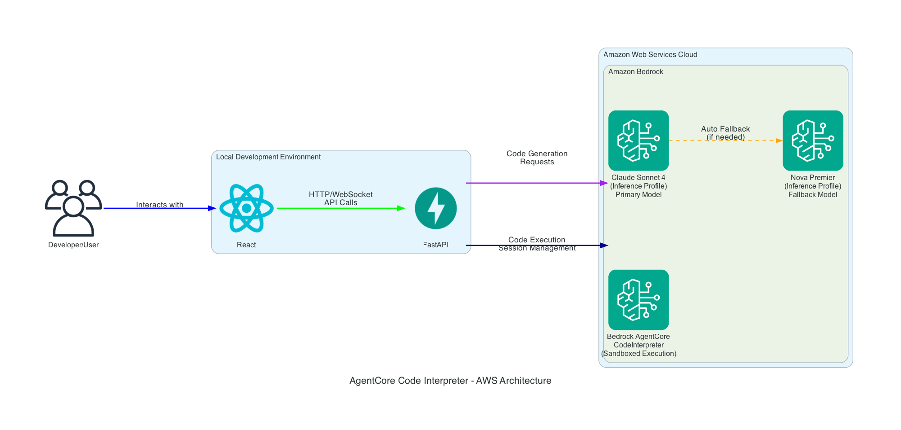

# Text to Python IDE

A powerful AI-powered code generation and execution platform that combines **Strands-Agents** framework with **AWS Bedrock AgentCore** for intelligent Python code development.

## 🎯 Overview

Text to Python IDE is a full-stack application that enables users to:

- **Generate Python code** from natural language descriptions using advanced AI models
- **Execute code safely** in AWS-managed sandboxed environments
- **Upload CSV files** for data analysis and processing in generated code
- **Interact with results** through a modern web interface
- **Manage sessions** with persistent conversation history

### Key Features

- 🤖 **AI-Powered Code Generation** using Claude Sonnet 4 and Nova Premier
- ⚡ **Real-time Code Execution** via AWS Bedrock AgentCore
- 📊 **CSV File Upload & Integration** for data analysis workflows
- ⏱️ **Execution Timer** with visual feedback for long-running operations
- 🔄 **Intelligent Model Fallback** for maximum reliability
- 🌐 **Modern Web Interface** built with React and AWS Cloudscape
- 📋 **Session Management** with execution history
- 🔒 **Secure Execution** in isolated AWS environments
- 📁 **File Upload Support** for existing Python files and CSV data
- 🚀 **Performance Optimized** with caching and connection pooling
- 🧪 **Comprehensive Testing** with automated end-to-end validation
- 🎨 **Chart Rendering** for data visualization with matplotlib/seaborn

## 🏗️ Architecture



### Component Details

#### **Frontend (React + AWS Cloudscape)**
- **Code Generator Tab**: Natural language to Python code conversion
- **Code Editor Tab**: Monaco-based editor with syntax highlighting
- **Execution Results Tab**: Formatted output display with error handling
- **Session History Tab**: View execution and conversation history

#### **Backend (FastAPI + Strands-Agents)**
- **Code Generator Agent**: Uses Claude Sonnet 4 for intelligent code generation
- **Code Executor Agent**: Integrates with AgentCore for safe code execution
- **Session Management**: RESTful APIs and WebSocket support
- **Model Fallback**: Automatic failover between AI models

#### **AI Models (AWS Bedrock)**
- **Primary**: Claude Sonnet 4 (Inference Profile) - `us.anthropic.claude-sonnet-4-20250514-v1:0`
- **Fallback**: Nova Premier (Inference Profile) - `us.amazon.nova-premier-v1:0`
- **Safety Net**: Claude 3.5 Sonnet - `anthropic.claude-3-5-sonnet-20241022-v2:0`

#### **Execution Environment (AgentCore)**
- **Sandboxed Python Environment**: Isolated execution in AWS
- **Real-time Results**: Streaming output and error handling
- **Session Persistence**: Maintains state across executions

## 🚀 Quick Start

### Prerequisites

- **Python 3.8+** with pip
- **Node.js 16+** with npm
- **AWS Account** with Bedrock access
- **AWS CLI** configured or credentials available

### 1. Setup and Start

The application includes automatic setup - just run the start script:

```bash
# Start the application (includes automatic setup)
./start.sh

# The script will automatically:
# - Create Python virtual environment if needed
# - Install all dependencies
# - Create .env configuration file
# - Start both backend and frontend servers
```

### 2. Configure Environment (Optional)

If you need to customize AWS credentials, edit the `.env` file:

```bash
# AWS Configuration (choose one method)
AWS_PROFILE=your_profile_name          # Recommended

# Application Configuration
BACKEND_HOST=0.0.0.0
BACKEND_PORT=8000
REACT_APP_API_URL=http://localhost:8000
```

### 3. Access Application

After running `./start.sh`, access:
- **Frontend**: http://localhost:3000
- **Backend API**: http://localhost:8000

### 4. Verify Setup (Optional)

```bash
# Verify setup (optional - start.sh does this automatically)
python tests/verify_setup.py

# Run comprehensive tests
python tests/run_all_tests.py
```

## 📋 Usage

### Code Generation
1. Navigate to the **Code Generator** tab
2. **Optional**: Upload a CSV file using the "Upload CSV File" button for data analysis tasks
3. Enter a natural language description (e.g., "Create a function to calculate fibonacci numbers" or "Analyze the uploaded CSV data and create visualizations")
4. Click **Generate Code**
5. Review the generated code in the **Code Editor** tab

### CSV File Integration
1. In the **Code Generator** tab, click **Upload CSV File**
2. Select your CSV file (must have .csv extension)
3. The file will be available for use in code generation
4. When you mention data analysis, files, or CSV in your prompt, the AI will automatically incorporate your uploaded data
5. If you mention files in your prompt but haven't uploaded a CSV, you'll be prompted to upload one

### Code Execution
1. In the **Code Editor** tab, review or modify your code
2. Click **Execute Code** for immediate execution
3. Click **Interactive Execute** for code requiring user input
4. View results in the **Execution Results** tab

### File Upload
1. In the **Code Editor** tab, use the file upload component
2. Select a `.py` or `.txt` file
3. The file content will be loaded into the editor
4. Execute or modify as needed

## 🛠️ Development

### Project Structure

```
├── backend/                 # FastAPI backend
│   ├── main.py             # Main application
│   └── requirements.txt    # Python dependencies
├── frontend/               # React frontend
│   ├── src/
│   │   ├── App.js         # Main application
│   │   └── components/    # React components
│   └── package.json       # Node dependencies
├── tests/                  # Test scripts
│   ├── run_all_tests.py   # Comprehensive test suite
│   └── verify_setup.py    # Setup verification
├── docs/                   # Documentation
├── .env                    # Environment configuration
├── setup.sh               # Setup script
└── start.sh               # Start script
```

### Running Tests

```bash
# Verify setup
python tests/verify_setup.py

# Run comprehensive tests
python tests/run_all_tests.py

# Run automated end-to-end tests (no user input required)
python tests/automated_e2e_test.py

# Test specific components
python -c "from tests.run_all_tests import TestRunner; runner = TestRunner(); runner.test_code_generation_api()"
```

### Development Mode

```bash
# Backend only
source venv/bin/activate
python backend/main.py

# Frontend only
cd frontend
npm start

# Watch mode with auto-reload
# Backend: Use uvicorn --reload
# Frontend: npm start (includes hot reload)
```

## 🔧 Configuration

### AWS Permissions Required

Your AWS user/role needs these permissions:

```json
{
    "Version": "2012-10-17",
    "Statement": [
        {
            "Effect": "Allow",
            "Action": [
                "bedrock:InvokeModel",
                "bedrock:ListFoundationModels"
            ],
            "Resource": "*"
        },
        {
            "Effect": "Allow",
            "Action": [
                "bedrock-agentcore:StartCodeInterpreterSession",
                "bedrock-agentcore:StopCodeInterpreterSession",
                "bedrock-agentcore:InvokeCodeInterpreter"
            ],
            "Resource": "*"
        }
    ]
}
```

Or use the managed policy: `BedrockAgentCoreFullAccess`

### Model Configuration

The application automatically selects the best available model:

1. **Claude Sonnet 4** (Inference Profile) - Primary choice
2. **Nova Premier** (Inference Profile) - Automatic fallback
3. **Claude 3.5 Sonnet** - Safety fallback

### Environment Variables

| Variable | Description | Default |
|----------|-------------|---------|
| `AWS_PROFILE` | AWS profile name | - |
| `AWS_REGION` | AWS region | `us-east-1` |
| `BACKEND_HOST` | Backend host | `0.0.0.0` |
| `BACKEND_PORT` | Backend port | `8000` |
| `REACT_APP_API_URL` | Frontend API URL | `http://localhost:8000` |

#### Timeout Configuration

| Variable | Description | Default | Max Recommended |
|----------|-------------|---------|-----------------|
| `AWS_READ_TIMEOUT` | AWS Bedrock read timeout (seconds) | `600` | `600` |
| `AWS_CONNECT_TIMEOUT` | AWS connection timeout (seconds) | `120` | `300` |
| `AWS_MAX_RETRIES` | Maximum retry attempts | `5` | `10` |
| `AGENTCORE_SESSION_TIMEOUT` | AgentCore session timeout (seconds) | `1800` | `1800` |
| `REACT_APP_EXECUTION_TIMEOUT_WARNING` | UI warning threshold (seconds) | `300` | - |
| `REACT_APP_MAX_EXECUTION_TIME` | UI max time display (seconds) | `600` | - |

**Note**: These timeout values are optimized for complex code execution including data analysis, machine learning, and visualization tasks.

## 🧹 Cleanup

```bash
# Stop the application
# Press Ctrl+C in the terminal running start.sh

# Or manually stop processes
lsof -ti:8000 | xargs kill -9  # Backend
lsof -ti:3000 | xargs kill -9  # Frontend

# Clean up temporary files
rm -f backend.log frontend.log *.pid
```

## 🐛 Troubleshooting

### Common Issues

**Backend won't start:**
- Check AWS credentials: `aws sts get-caller-identity`
- Verify dependencies: `python tests/verify_setup.py`
- Check logs: `tail -f backend.log`

**Frontend won't start:**
- Install dependencies: `cd frontend && npm install`
- Check Node version: `node --version` (requires 16+)
- Clear cache: `npm start -- --reset-cache`

**Code generation fails:**
- Verify Bedrock access: Check AWS permissions
- Test model availability: `python tests/run_all_tests.py`
- Check region: Ensure models are available in your region

**Code execution fails:**
- Verify AgentCore permissions: `BedrockAgentCoreFullAccess`
- Test AgentCore directly: See test scripts in `tests/`
- Check session limits: AgentCore has concurrent session limits

### Getting Help

1. **Run diagnostics**: `python tests/verify_setup.py`
2. **Check logs**: `backend.log` and `frontend.log`
3. **Test components**: `python tests/run_all_tests.py`
4. **Verify AWS setup**: `aws bedrock list-foundation-models`

## 📄 License

This project is part of the Strands-Agents ecosystem. Please refer to the main project license.

---

**Ready to start coding with AI? Run `./start.sh` and visit http://localhost:3000** 🚀
